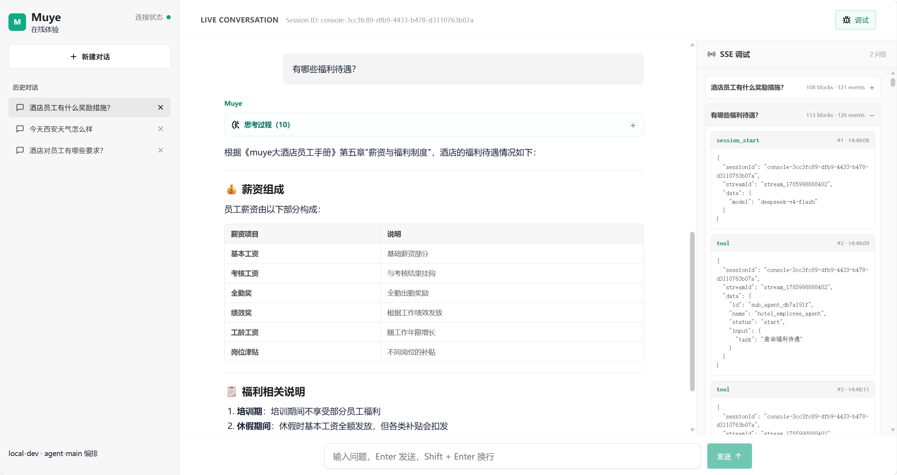

<div align="center">

# Muye Multi-Agent Scaffold v2.1

**An open-source, self-hosted scaffold for knowledge-Agent construction and multi-agent runtime**

Business materials -> knowledge build and evaluation -> standalone SubAgent -> local integration -> auditable deployment

English · [简体中文](README.md)

   



</div>

Muye Multi-Agent Scaffold is built on
[`muye-multi-agent-sdk`](https://github.com/muye-x/muye-multi-agent-sdk). It converts business materials directly into runnable knowledge agents. One command builds knowledge, evaluates retrieval quality, generates code, and starts a local web integration environment:

```bash
./scripts/muye.sh agent prepare agent-projects/<slug> \
  --auto-approved-by <reviewer> \
  --dev
```

Developers can validate the complete Gateway -> MainAgent -> SubAgent call path
without building a Docker image, publishing a Catalog, or configuring production
user grants first.

> For development teams that need to deliver controlled business material as verifiable knowledge Agents. The scaffold treats generation, evaluation, auditability, and deployment as one workflow.

## 1. Problems solved

| Development and delivery challenge | What the scaffold provides |
| --- | --- |
| **Materials do not become runnable Agents** | Generate a standalone SubAgent, descriptor, and contract tests from version-controlled `project.yaml` and source materials. |
| **Retrieval quality cannot be demonstrated** | Evaluate immutable Milvus Collections with Dense, Keyword, and Hybrid retrieval; publish a Resource Snapshot only after it passes. |
| **Local request paths are hard to reproduce** | One command starts or reuses LLM, Data, MainAgent, SubAgent, and the Vue Web Gateway. |
| **Streaming behavior is hard to debug** | The web chat exposes SSE content, tool activity, citations, errors, and raw per-turn events. |
| **Development and production grants interfere** | Local development uses temporary identities and runtime directories while production Catalog, BuildRecord, and user grants remain isolated. |
| **The Agent lifecycle has no control plane** | Build, Catalog synchronization, deployment, stop, and rollback commands validate checksums, health, and the request path. |

## 2. Capability map

| Stage | Core capability | Output or guarantee |
| --- | --- | --- |
| **Define** | `project.yaml`, business materials, generation plan, and approval records | Version-controlled Agent inputs and traceable approval. |
| **Build knowledge** | Document parsing, immutable Collections, Embedding, and resource snapshots | Clear boundaries between materials, knowledge versions, and Milvus entities. |
| **Evaluate quality** | Dense, Keyword, Hybrid retrieval, and citation-coverage gates | A candidate cannot become the active Snapshot until it passes evaluation. |
| **Generate and validate** | Templates, descriptors, retrieval tests, and contract tests | An independent, verifiable `agents/agent-<slug>/`. |
| **Integrate locally** | MainAgent orchestration, SSE, Vue Web Gateway, and a debug drawer | Validate the end-to-end request path before a production release. |
| **Operate in production** | Catalog, grants, health checks, deployment, stop, and rollback | Auditable deployment state and controlled authorization data. |

## 3. Architecture

```text
Web / API Client
       |
       v
muye-gateway  -->  agent-main  -->  agent-<slug>
       |                 |               |
       v                 v               v
muye-channels         muye-llm       muye-data  -->  Milvus
                         |
                         +----------> OpenAI-compatible models

control  -->  Catalog / grant / health / citation authorization
```

| Service | Default port | Responsibility |
| --- | ---: | --- |
| `muye-llm` | 9850 | Chat, SSE, Embedding, and model-alias gateway |
| `muye-data` | 9840 | Dense, Keyword, Hybrid retrieval and Rerank orchestration |
| `agent-<slug>` | 8000 | Generated business knowledge SubAgent |
| `agent-main` | 9860 | Chat, tool calls, and SubAgent orchestration |
| `control` | 9880 | Catalog, grants, health, and citation projection |
| `muye-channels` | 9890 | Isolated WeChat iLink binding, message cursor, and delivery service |
| Web Dev Gateway | 5173 | v2.1 local chat and SSE debugging UI |
| `muye-gateway` | 80/443 | Production TLS, authentication, and public routing |

## 4. Quick start

### 1. Install dependencies

Python 3.11+ is required. This repository uses the root `.venv`:

```bash
python3 -m venv .venv
.venv/bin/python -m pip install --upgrade pip
.venv/bin/python -m pip install -r requirements.txt
```

### 2. Configure model and knowledge-build services

For a first knowledge Agent, prepare these two files:

```bash
cp muye-llm/.env.example muye-llm/.env
cp tools/agent_creation/.env.example tools/agent_creation/.env
```

Configure the OpenAI-compatible Chat/Embedding upstream, credentials, and model
aliases in `muye-llm/.env`. Configure service endpoints for the creation tools in
`tools/agent_creation/.env`:

```dotenv
MUYE_KNOWLEDGE_LLM_BASE_URL=http://127.0.0.1:9850
MUYE_KNOWLEDGE_MILVUS_URI=http://127.0.0.1:19530
MUYE_KNOWLEDGE_MILVUS_TOKEN=
```

Keep secrets, tokens, and database connection strings only in each service's
`.env` file or its runtime environment. Do not put them in `project.yaml`.

### 3. Start dependencies

Start the model gateway:

```bash
cd muye-llm
../.venv/bin/python main.py
```

If no Milvus instance is available, start the repository's local development
environment in another terminal:

```bash
./poc/phase1/milvus/start-local.sh
```

For an existing or hosted Milvus instance, update `MUYE_KNOWLEDGE_MILVUS_URI`
instead of starting the local Compose environment.

### 4. Prepare materials

Put source projects in `agent-projects/`; generated code is written to `agents/`:

```text
agent-projects/<slug>/
├── project.yaml
└── sources/
    ├── handbook.md
    └── policy.pdf
```

`project.yaml` describes the Agent's identity, goals, prohibited behavior, model
alias, and example questions. Markdown and TXT are processed directly; DOCX and
PDF require their corresponding parsing dependencies.

[`agent-projects/hotel-employee/`](agent-projects/hotel-employee/) is a runnable
example input project containing an Agent definition and an employee handbook.
Its generated Agent, creation configuration, and Milvus data are intentionally
absent and are created locally by the next command.

### 5. Generate and integrate in one command

Return to the repository root and run:

```bash
./scripts/muye.sh agent prepare agent-projects/<slug> \
  --auto-approved-by <reviewer> \
  --dev
```

The command performs the following operations:

1. Reads the project definition and materials, then creates a generation plan and
   checksum approval record.
2. Builds an immutable Milvus Collection and evaluates Dense, Keyword, and Hybrid
   retrieval.
3. Publishes an active Resource Snapshot and generates the `agents/agent-<slug>/`
   code and descriptor.
4. Runs contract and retrieval tests for the generated Agent.
5. Starts the complete local request path and Web Dev Gateway.

`--auto-approved-by` records the approver only; it never bypasses material drift,
Embedding, Milvus, or retrieval-evaluation gates.

After startup, open:

```text
http://127.0.0.1:5173/chat
```

Press `Ctrl+C` to stop the development session. To integrate an already generated
Agent again, run:

```bash
./scripts/muye.sh agent dev <slug>
```

## 5. Web integration

The v2.1 `/chat` page shows the actual MainAgent -> SubAgent execution path:

- Main content is streamed in SSE `block.delta` arrival order.
- Tool calls, retrieval logs, and citations are grouped in a collapsible reasoning
  panel.
- Markdown, GFM tables, code blocks, and lists are supported.
- Raw SSE events for each turn are independently collapsed from `session_start` to
  `session_end`.
- Conversations, reasoning details, and SSE traces are stored in browser
  `localStorage`; each conversation can be removed independently.
- The conversation pane scrolls independently, the input remains fixed at the
  bottom, and active streaming requests can be cancelled.

## 6. Common commands

| Command | Purpose |
| --- | --- |
| `./scripts/muye.sh agent prepare <project> --auto-approved-by <reviewer> --dev` | Generate an Agent from materials and immediately integrate it locally |
| `./scripts/muye.sh agent dev <slug>` | Restart local integration for a generated Agent |
| `./scripts/muye.sh agent list` | List generated or registered Agents |
| `./scripts/muye.sh agent validate <slug>` | Validate generated artifacts and contracts |
| `./scripts/muye.sh agent build <slug> --base-image '<image>@sha256:<digest>'` | Test and create a production image record |
| `./scripts/muye.sh agent sync --check` | Check the Catalog aggregation result |
| `./scripts/muye.sh agent deploy <slug>` | Deploy an Agent and run a request-path smoke test |
| `./scripts/muye.sh agent stop <slug>` | Remove and stop an Agent from the Catalog |
| `./scripts/muye.sh agent rollback <slug> --build-record <id>` | Roll back to a specified build record |

For a reviewable, stepwise approval flow, material changes, or CI integration, see
[Create and test a knowledge Agent](docs/agent-creation-quickstart.md) (Chinese).

## 7. Control console and WeChat Channel

The production console provides service status, chat, user-to-Agent grants, and WeChat binding. `/agents` redirects to the service-status page, and a signed-in user can manage one active WeChat binding. After scan confirmation, WeChat text messages enter MainAgent with the grants of the bound user; images, voice messages, files, and video are not forwarded to an Agent.

`muye-channels` isolates iLink credentials, the QR flow, message cursors, and delivery state. Gateway proxies `/api/v2/channels/` to this internal service only after a Control session has been authenticated, and adds a separate channels caller token. A production deployment needs distinct `MUYE_CHANNELS_CALLER_TOKEN`, `MUYE_CHANNELS_MAIN_TOKEN`, and a base64-encoded 32-byte `MUYE_CHANNELS_ENCRYPTION_KEY`; none may be reused as another service credential. See [WeChat Channel integration](docs/wechat-channel.en.md).

MainAgent keeps separate circuit-breaker and concurrency protection for each SubAgent: one request calls the same SubAgent at most once by default, waits for a bounded period when it is busy, and treats an empty response as a dependency error. Tune these deployment limits with `MUYE_AGENT_QUEUE_WAIT_SECONDS`, `MUYE_AGENT_MAX_CALLS_PER_REQUEST`, `MUYE_STREAM_IDLE_TIMEOUT_SECONDS`, and `MUYE_STREAM_MAX_HOLD_TIMEOUT_SECONDS`.

## 8. Streaming protocol

SubAgents expose the internal `/health`, `/capabilities`, `/invoke`,
`/invoke/stream`, and `/cancel` APIs. Streaming events follow this lifecycle:

```text
session_start -> block / tool / thinking -> done -> session_end
```

Append `delta` values for the same `block.id` in arrival order; handle distinct
blocks independently.

## 9. Tests

```bash
PYTHONPATH=muye-llm:muye-gateway \
  .venv/bin/python -m pytest -q muye-llm/tests muye-gateway/dashboard_api/tests
PYTHONPATH=muye-data \
  .venv/bin/python -m pytest -q muye-data/tests
PYTHONPATH=agents/agent-main \
  .venv/bin/python -m pytest -q agents/agent-main/tests
.venv/bin/python -m pytest -q tests
.venv/bin/python main.py --dry-run
```

## 10. Documentation

Detailed technical documentation is primarily maintained in Chinese. See the English
[documentation index](docs/README.en.md) for English documents, summaries, and links.

- [Create and test a knowledge Agent](docs/agent-creation-quickstart.md)
- [Template Agent Generator and developer ownership](docs/v2.0-agent-generator.md)
- [Knowledge pipeline and evaluation](docs/v2.0-knowledge-pipeline.md)
- [Agent Catalog, grants, and deployment](docs/v2.0-agent-catalog.md)
- [Administrator guide](docs/v2.0-admin-guide.md)
- [Operations guide](docs/v2.0-operations.md)
- [Release checklist](docs/v2.0-release-checklist.md)
- [WeChat Channel integration](docs/wechat-channel.en.md)
- [Production deployment guide](deploy/README.en.md)
- [Hermes integration with Muye Main Agent](docs/Hermes接入指南.md) (Chinese)

## 11. Security boundary

- `agent dev` listens on loopback only, registers only the current SubAgent, and
  uses a temporary random token with a local-development identity.
- Local integration data is written to `config/runtime/dev/<slug>/`; it does not
  modify the production Control Catalog, BuildRecord, or user grants.
- `muye-data` and `muye-llm` must be accessible only to trusted internal services;
  database accounts must be read-only.
- Production exposes only Gateway Web, `/api/v2/`, and `/agentMain/`;
  `/api/v2/channels/` requires an authenticated Control session. Every SubAgent
  uses the internal profile.

## License

This project is released under the [MIT License](LICENSE). Third-party license
notices are in [THIRD_PARTY_NOTICES.md](THIRD_PARTY_NOTICES.md).
