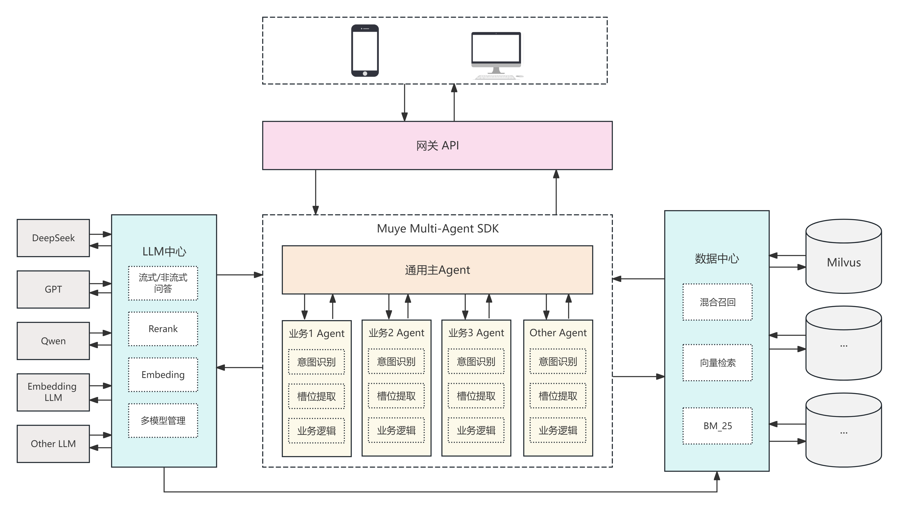
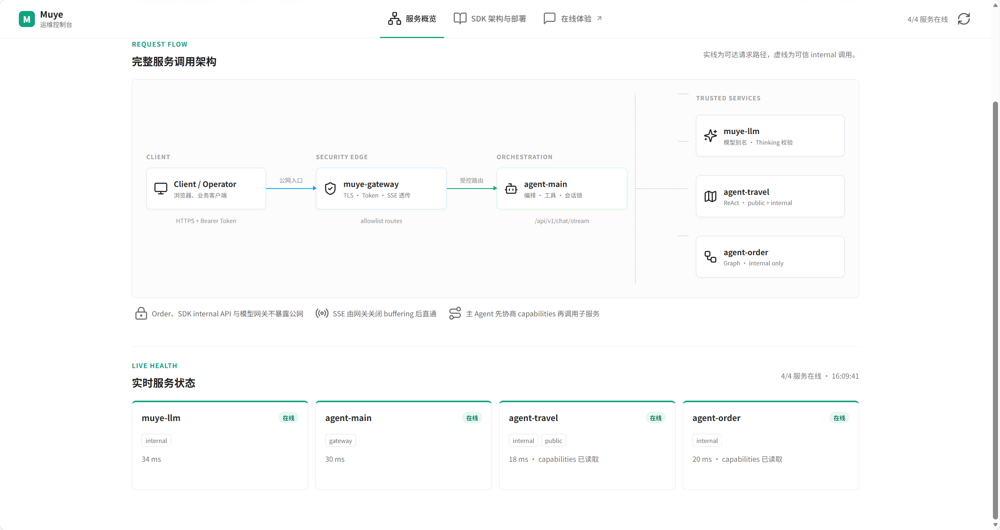
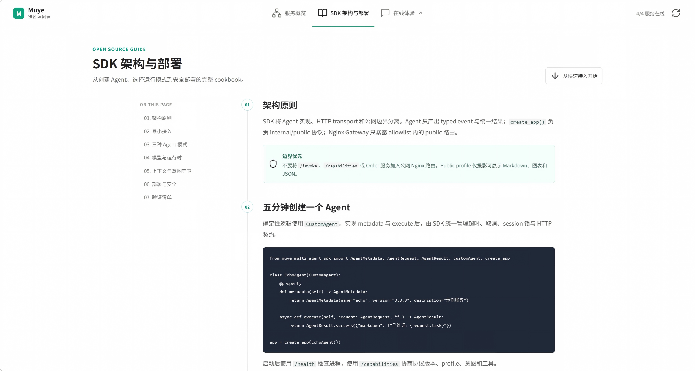
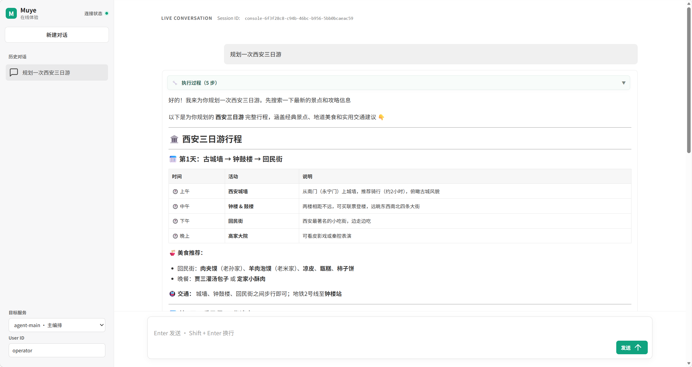

# Muye Multi-Agent Scaffold

Muye Multi-Agent Scaffold 是一个基于
[`muye-multi-agent-sdk`](https://github.com/muye-x/muye-multi-agent-sdk) 的多服务脚手架工程。开发者可以使用该项目快速搭建属于自己的多智能体项目。仓储包含
统一模型网关、可选只读数据召回服务、主编排 Agent、两个子 Agent 示例以及可选的 Nginx Gateway；SDK 在独立仓储
维护，并通过 Python 包依赖接入。

## 界面预览

### 架构图



### 服务概览



### SDK 架构与部署



### 在线体验



## 架构

```text
Client
  |
  +-- muye-gateway: 80/443 (可选公网入口)
          |
          +-- agent-main: 9860
                  |
                  +-- muye-llm: 9850 -> OpenAI-compatible 上游
                  +-- control: 9880 -> Catalog、授权、健康和 citation 投影
                  +-- muye-data: 9840 -> Milvus（可选、只读）
                  +-- agent-<slug>: internal only -> muye-data
```

| 服务 | 端口 | 职责 |
| --- | ---: | --- |
| `muye-llm` | 9850 | 模型注册、thinking 校验、Chat/SSE/Embedding 网关 |
| `muye-data` | 9840 | 查询、Dense/Keyword/Hybrid 召回、融合、Rerank 编排与数据库适配 |
| `agent-main` | 9860 | 对话、SSE、工具调用与子 Agent 编排 |
| `control` | 9880 | active Catalog、健康状态、User-Agent grant 与 citation 授权投影 |
| `muye-gateway` | 80/443 | Bearer Token、TLS 与公网路由 allowlist |

## 依赖

Python 3.11 或更高版本。核心 SDK 使用 [muye-multi-agent-sdk](https://github.com/muye-x/muye-multi-agent-sdk) v2.0.0。

## 安装

安装 GitHub 上固定版本的 SDK 与全部服务依赖：

```bash
python3 -m venv .venv
.venv/bin/python -m pip install --upgrade pip
.venv/bin/python -m pip install -r requirements.txt
```

## 配置

仓储提供根目录和各服务目录两类 `.env.example`。它们只是可提交的配置模板，程序不会直接
读取 `.env.example`；使用时需要复制为同目录下的 `.env`，并填写实际运行值。

| 配置模板 | 配置范围 | 适用方式 |
| --- | --- | --- |
| `.env.example` | 全部服务的一键启动聚合配置 | 本地开发、整体联调 |
| `muye-llm/.env.example` | LLM、Embedding 与可选 LangSmith 配置 | 单独部署 `muye-llm` |
| `muye-data/.env.example` | 只读数据服务、资源配置文件与数据库凭据引用 | 单独部署 `muye-data` |
| `agents/agent-main/.env.example` | 主 Agent、存储、检索与子 Agent 地址 | 单独部署 `agent-main` |
| `muye-gateway/.env.example` | Nginx、TLS、Gateway 与控制台配置 | 单独部署 Gateway |

本地一键启动只需创建根目录 `.env`：

```bash
cp .env.example .env
```

`MUYE_LLM_API_KEY` 与 `MUYE_LLM_EMBED_API_KEY` 是当前 LLM 服务启动所需配置；默认模型和主 Agent 使用的 `MUYE_LLM_MODEL` 必须
存在于 `MUYE_LLM_MODELS_JSON`。

通过根启动器运行时，配置优先级为：

```text
Shell 环境变量 > 根目录 .env > 服务目录 .env > 源码默认值
```

通过服务入口独立运行时，不读取根目录 `.env`，配置优先级为：

```text
Shell 环境变量 > 当前服务目录 .env > 源码默认值
```

## 启动

### 方式一：一键启动全部服务

该方式由根目录 `main.py` 统一加载根 `.env`，按依赖顺序启动全部服务并等待健康检查，适合
本地开发和整体联调：

```bash
.venv/bin/python main.py --dry-run
.venv/bin/python main.py --timeout 20
```

`--dry-run` 只检查服务入口和配置，不启动进程；即使没有真实密钥也可用于 CI 结构检查。
启动器按 `muye-llm -> muye-data（启用时） -> agent-main -> dashboard-api`
顺序等待健康检查。`MUYE_DATA_ENABLED=false` 时跳过数据服务，因此默认本地运行不要求
Milvus。阶段 5 的 Control 与生成 Agent 生命周期是独立部署路径，不由该兼容启动器隐式启动。
生产控制台由 Gateway 提供；本地 `dashboard-api` 仅用于内部认证与状态探测。

### 方式二：独立启动或部署单个服务

该方式在目标服务目录复制其配置模板，只安装或注入该服务需要的配置，适合容器部署、生产
环境和单服务调试。例如单独启动 LLM 服务：

```bash
cd muye-llm
cp .env.example .env
../.venv/bin/python main.py
```

生成的 Agent 通过 `scripts/muye.sh agent deploy <slug>` 进入同一个 Compose project。Gateway 的 `.env` 主要由
`scripts/render-nginx-config.sh` 读取以生成 Nginx 配置；本地 Dashboard API 可直接使用默认值
或由进程环境注入 `MUYE_DASHBOARD_*`。

## 协议

子 Agent internal API 为 `/health`、`/capabilities`、`/invoke`、`/invoke/stream` 和
`/cancel`。流式生命周期为：

```text
session_start -> block/tool/thinking -> done -> session_end
```

同一 `block.id` 的 `delta` 按到达顺序追加；不同 block ID 必须独立处理。所有生成 SubAgent 仅使用 internal profile。

`muye-data` 只公开 `/api/v1/retrieve`、已知资源 capabilities、`/health` 和 `/ready`。
Agent 通过 SDK 的 `DataClient` 按需调用逻辑 resource alias；不存在公开 `search` 或任何建库、
写入、更新、删除接口。数据库结构、索引和数据生命周期由独立数据项目负责。完整配置和
过滤 AST 见 `muye-data/README.md`。

## 测试

仓储只保留长期质量资产：模块单元测试、服务/协议集成测试和 Gateway 系统 smoke test。测试均
隔离真实模型与外部网络，不包含临时调试脚本或生成结果。

```bash
PYTHONPATH=muye-llm:muye-gateway \
  .venv/bin/python -m pytest -q muye-llm/tests muye-gateway/dashboard_api/tests
PYTHONPATH=muye-data \
  .venv/bin/python -m pytest -q muye-data/tests
PYTHONPATH=agents/agent-main \
  .venv/bin/python -m pytest -q agents/agent-main/tests
.venv/bin/python -m pytest -q tests
.venv/bin/python main.py --dry-run
```

生产 Gateway 的连通性与鉴权检查使用：

```bash
muye-gateway/scripts/smoke-test.sh
```

## 模板 Agent 生成

v2.0 的知识 Agent 由本地、确定性 Generator 生成，首次产物位于
`agents/agent-<slug>/`。Generator 只读取版本控制中的逻辑 Resource、Retrieval Skill 和已确认 Profile；
它不连接 Milvus、不读取密钥，也不会覆盖已存在的 Agent 目录。

```bash
./scripts/muye.sh knowledge analyze <knowledge-slug>
./scripts/muye.sh knowledge approve-schema <knowledge-slug> --checksum <sha256> --approved-by <principal>
./scripts/muye.sh knowledge approve-skill <knowledge-slug> --checksum <sha256> --approved-by <principal>
./scripts/muye.sh agent approve-profile <agent-slug> --checksum <sha256> --approved-by <principal>
./scripts/muye.sh agent generate <agent-slug> --knowledge <knowledge-slug>
./scripts/muye.sh agent validate <agent-slug>
./scripts/muye.sh agent diff <agent-slug> --template latest
```

命令可从任意目录调用，Shell wrapper 会定位 Scaffold 根目录并使用根 `.venv`。三个确认命令会在
`config/approvals/{resource,skill,profile}/` 写入可提交的审批记录；任一 revision 或 checksum 变化后必须
重新确认，Generator 缺少匹配记录时会拒绝生成。输入配置结构、生成后的接管流程及模板升级方式见
[模板 Agent Generator 与开发者接管](docs/v2.0-agent-generator.md)。阶段 4 的源文件构建配置与上述逻辑
输入隔离在 `config/knowledge-sources/`：先生成并确认 Schema Proposal，再构建不可变 Milvus Collection 与
候选 Snapshot；隔离评测通过后才会原子发布 active Snapshot。阶段 3 的
`knowledge analyze/approve-schema/approve-skill` 不变，阶段 4 使用 `knowledge propose-schema` 与
`knowledge approve-proposal`。完整流程、OCR 依赖、Job 状态和评测发布见
[知识 Pipeline 与评测](docs/v2.0-knowledge-pipeline.md)。

## Agent Catalog 与部署生命周期

阶段 5 使用 `agent.yaml`、当前源码 checksum 和 `AgentBuildRecordV1` 确定性派生 Catalog 与 Compose aggregate，
MainAgent 不再从固定 URL 环境变量发现 SubAgent。空 Catalog 可以健康启动；启用部署的 Agent 必须引用阶段 4
active Resource Snapshot 中已经发布的逻辑 Resource。

```bash
./scripts/muye.sh agent list
./scripts/muye.sh agent build <agent-slug> --base-image '<image>@sha256:<digest>'
./scripts/muye.sh agent sync
./scripts/muye.sh agent sync --check
./scripts/muye.sh agent deploy <agent-slug>
./scripts/muye.sh agent stop <agent-slug>
./scripts/muye.sh agent rollback <agent-slug> --build-record <build-record-id>
```

`agent build` 先运行生成 Agent 的 compile/test，再构建镜像并记录本机 Docker 内容摘要。`deploy` 依次确认本机镜像、
启动目标服务、提交 Control candidate、等待 Main ACK，并通过已授权用户执行 Main -> Sub smoke；`stop` 的顺序相反，
先从 Catalog 移除并等待 ACK，再停止容器。当前阶段不向 registry 发布 manifest，真实 Docker build/deploy/rollback
必须在具备 Docker daemon、Control/Main、有效 grant 和三类独立服务 token 的目标环境验证。完整配置、产物归属、grant
格式和故障语义见 [Agent Catalog、权限与部署](docs/v2.0-agent-catalog.md)。

## v2.0 运维与迁移

- [迁移指南](docs/v2.0-migration.md)：从固定示例迁移到经审批的生成 Agent。
- [管理员指南](docs/v2.0-admin-guide.md)：初始化用户、grant 与状态判断。
- [运维指南](docs/v2.0-operations.md)：Compose、备份恢复和发布前验证。
- [发布检查表](docs/v2.0-release-checklist.md)：Alpha、RC 和正式版本门禁。

## 安全边界

- `muye-data` 与 `muye-llm` 只允许可信内网服务访问；数据库账号必须限制为只读权限。
- `muye-data` 不负责创建或修改 Collection、Index、表、文档与向量。
- 生产必须启用 Data Agent 身份校验；同一 Agent 的 Main、Control、Data token 必须非空且互不相同。
- 生产只公开 Gateway 的 Web、`/api/v2/` 与 `/agentMain/`；登录会话由 Control 校验，所有 SubAgent 均不暴露公网端口。

项目许可证：[MIT](LICENSE)。内置前端资源及迁移代码的许可证见
[THIRD_PARTY_NOTICES.md](THIRD_PARTY_NOTICES.md)。
