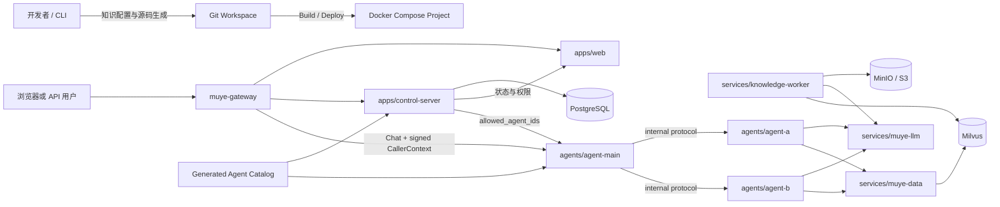

# Muye Multi-Agent Scaffold v2.0 模板 Agent 代码生成实施方案

> 状态：实施中（已确认的 v2.0 开发基线）  
> 目标版本：Scaffold `v2.0.0` / SDK `v2.0.0`  
> 开发分支：Scaffold `v2.0.x-dev` / SDK `v2.0.x-dev`  
> 当前阶段：阶段 4 - Knowledge Pipeline 与 Milvus（实现与常规验证已完成）
> 更新日期：2026-07-30

## 1. 文档目的

本方案把 Muye Multi-Agent Scaffold v2.0 定位为面向开发者的知识 Agent 代码脚手架：平台先把原始
知识文件转换为经过确认和评测的逻辑知识资源，再根据知识结构、检索 Skill 和标准 SDK 模板，在仓库
`agents/` 目录生成一个可直接运行、测试和继续开发的 SubAgent 源码目录。

源码生成完成后由开发者和 Git 接管。平台不在线编辑、覆盖或热加载开发者代码；开发者可以在保持
SDK internal 协议、身份和权限边界的前提下修改 Prompt、工具和业务逻辑。部署脚本根据每个 Agent 的
`agent.yaml` 确定性生成 Compose 服务与 Agent Catalog，完成构建、健康检查和注册；`agent-main`
只调用已注册且当前用户明确授权的 SubAgent。

Web 不是低代码 Agent 构建器。v2.0 Web 只承担登录、主/子 Agent 健康状态、固定调用拓扑和
User-Agent 授权关系的查看与管理。知识构建、Agent 生成、构建、部署和回滚使用 CLI、Git 和 CI。

本文件是 v2.0 唯一的实施基线；后续 ADR、任务拆分和验收均以本文件为准。

## 2. 已确认设计方向

| 主题 | v2.0 模板代码方案 |
| --- | --- |
| 产品形态 | 自托管、单工作区、多用户、开发者优先的 Agent 代码脚手架 |
| Agent 产物 | `agents/<agent-slug>/` 下可维护的标准 SDK 源码、描述符和来源记录 |
| 生成方式 | LLM 只生成受限 Proposal；Python、配置和测试骨架由版本化模板确定性渲染 |
| 生成时机 | 开发/构建阶段通过 CLI 显式执行，不在用户聊天请求或 Web 请求中生成代码 |
| 代码所有权 | 首次生成后由开发者和 Git 接管；生成器默认拒绝覆盖已有 Agent 目录 |
| SDK 模式 | 标准模板使用 `ReActAgent`；SDK 继续保留 `CustomAgent` 和 `GraphAgent` 公共能力 |
| Agent 运行 | 每个 SubAgent 是独立 SDK HTTP 服务；不建设共享 `agent-runtime` |
| 调用拓扑 | 只允许 `agent-main -> SubAgent`；禁止 SubAgent 调用 MainAgent 或其他 SubAgent |
| 自动对接 | `agent.yaml -> Catalog/Compose 生成 -> health/capabilities 校验 -> MainAgent 原子加载` |
| 发布方式 | 开发者通过 Git、CI、镜像和统一脚本显式部署；初版不承诺零停机热发布 |
| Web 范围 | 登录、Agent 健康/版本、Main-Sub 调用关系、User-Agent 授权关系 |
| Agent 权限 | 不设置 Agent 角色或动作权限；只使用 `user_agent_grants(user_id, agent_id)` |
| 控制面角色 | 只保留不可删除的内置 `Admin`；普通用户无角色也可登录和调用获授权 Agent |
| 用户认证 | 浏览器登录会话；v2.0 不创建 `user_key`、用户 API Key 或机器调用 Token |
| 知识检索 | 只使用 Milvus，提供标量过滤、Dense + BM25/Sparse、Weighted RRF 和可选 Rerank |
| 文档范围 | PDF、DOCX、Markdown、TXT；Docling 默认解析，PaddleOCR 为可选 profile |
| 部署方式 | 一个 Docker Compose project、多容器、统一 `scripts/muye.sh` 管理 |
| Python 环境 | 本地开发和测试统一使用 Scaffold 根目录 `.venv`，不使用 Conda |

## 3. 目标与非目标

### 3.1 目标

1. 开发者可以从原始知识文件和版本化配置构建可检索的 Milvus 知识资源。
2. 系统可以基于已确认的知识结构和检索 Skill 生成标准 SDK ReAct SubAgent 源码。
3. 生成结果可以直接编译、测试、构建镜像和独立启动，并包含来源引用和失败处理。
4. 开发者可以修改生成代码，且后续生成或模板升级不会静默覆盖人工修改。
5. 每个 Agent 使用稳定 `agent_id` 和严格 `agent.yaml` 描述身份、能力、资源和运行预算。
6. 统一脚本可以从所有有效 `agent.yaml` 生成 Compose override 和 Agent Catalog。
7. Agent 启动并通过 `/health`、`/ready`、`/capabilities` 后可自动进入 MainAgent Registry。
8. MainAgent 每个请求只向模型暴露当前用户获授权的 active SubAgent。
9. 系统从结构上限制为一层调用，不产生 Agent 递归、环路或跨 Agent 权限传播。
10. Web 可以展示配置拓扑、实时健康、版本/checksum、最近错误和 User-Agent 映射。
11. Agent 生成、同步、部署、下线和回滚均可通过 CLI/CI 重放并产生可审计结果。
12. Travel/Order 固定示例被标准模板、fixture 和生成器 smoke Agent 取代。

### 3.2 非目标

- 不建设 Dify 类节点画布、工作流市场或在线 Agent 编辑器。
- 不允许终端用户在聊天中生成、修改或执行 Python、Shell、SQL、Milvus DSL 或任意代码。
- 不让 LLM 自由决定 Python AST、依赖、网络地址、凭据、物理 Collection 或部署配置。
- 不由 Web 或 Control Server 写入 Git 工作区、执行 `docker build` 或访问 Docker Socket。
- 不在首次生成后自动合并或覆盖开发者修改的 Agent 源码。
- 不在 v2.0 提供 SubAgent 调用 MainAgent、SubAgent 调用 SubAgent 或任意多层 Agent 图。
- 不在 v2.0 提供 Agent 在线预览、无重启热更新、自动代码回滚或源码在线发布。
- 不在 v2.0 支持公网 SaaS 多租户、跨工作区共享、复杂计费或 Kubernetes。
- 不接入 OpenSearch，不提供多检索数据库选择。
- 不创建 Builder、Reviewer、Operator、Viewer 等控制面角色或 Agent 角色。
- 不创建 `user_key`、`user_api_keys`、ServicePrincipal、Hermes 接口或外部 API Token。
- 不把 Agent 源码、原始知识正文、密钥或物理数据地址暴露给 MainAgent 的模型上下文。

### 3.3 规模边界

每个 Agent 都是独立的代码与部署单元，镜像、进程、日志和资源占用会随 Agent 数量增长。v2.0 优先保证
1 至 20 个 SubAgent 的开发体验和正确性；更大规模的 Runner 池、调度和弹性伸缩放到后续版本评估。

## 4. 总体架构



系统只允许以下调用方向：

```text
Client -> Gateway -> MainAgent -> SubAgent -> muye-llm / muye-data
```

禁止：

```text
SubAgent -> MainAgent
SubAgent -> SubAgent
模型或用户参数 -> 任意 URL
```

## 5. 端到端工作流

```text
原始文件与 knowledge.yaml
  -> 解析 / 规范化 / 样本分析
  -> SchemaProposalV1
  -> 开发者确认 checksum
  -> Milvus Collection / Dense + BM25
  -> 检索评测
  -> RetrievalSkillProposalV1
  -> 开发者确认 checksum
  -> AgentProfileProposalV1
  -> 确定性模板渲染到 agents/agent-<slug>/
  -> 生成基线测试
  -> 开发者修改并提交 Git
  -> CI / build image
  -> agent sync / deploy / smoke
  -> AgentCatalogSnapshotV1
  -> MainAgent 原子加载
  -> User-Agent 映射授权
  -> 在线调用
```

Web 不参与上述构建链路。CLI 显示结构 Diff、确认 checksum、失败原因和下一步命令；不得以默认
`yes` 跳过 Schema/Skill 确认。

## 6. 目标目录结构

```text
scaffold/
├── agents/
│   ├── agent-main/                         # 唯一主编排 Agent
│   └── agent-<slug>/                       # 模板生成后由开发者维护
│       ├── agent.py                        # 标准 ReAct Agent，可修改
│       ├── main.py                         # SDK create_app 入口
│       ├── agent.yaml                      # 身份、资源、能力与部署描述符
│       ├── prompts/
│       │   └── system.md                   # 简体中文系统指令
│       ├── tests/
│       │   ├── test_contract.py
│       │   ├── test_retrieval.py
│       │   └── fixtures/
│       ├── Dockerfile
│       ├── requirements.txt
│       ├── README.md
│       └── .muye-generation.json           # 生成来源，不含密钥
├── apps/
│   ├── web/                                # 状态、拓扑、User-Agent 授权
│   └── control-server/                     # 身份、授权、Catalog 投影与状态采集
├── services/
│   ├── muye-llm/
│   ├── muye-data/
│   ├── knowledge-worker/
│   └── knowledge-worker-ocr/
├── templates/
│   └── agents/react-knowledge/v1/          # 只读、版本化模板源
├── tools/
│   ├── knowledge-cli/                      # 知识构建与确认 CLI
│   └── agent-generator/                    # 目录生成、校验、diff 与 provenance
├── contracts/
│   ├── schemas/
│   └── fixtures/
├── config/
│   ├── knowledge/                          # 可提交、无密钥的知识配置
│   ├── llm/                                # 模型 alias，不含凭据
│   ├── static/
│   └── generated/                          # BuildRecord/Catalog/Compose 输出，不手工编辑
├── infrastructure/
│   ├── gateway/
│   ├── compose/
│   ├── postgres/
│   ├── milvus/
│   └── object-storage/
├── scripts/
│   └── muye.sh
├── tests/
│   ├── contract/
│   ├── generator/
│   ├── integration/
│   ├── evaluation/
│   └── e2e/
├── compose.yaml
├── compose.agents.generated.yaml
├── .env.example
└── THIRD_PARTY_NOTICES.md
```

`config/generated/` 和 `compose.agents.generated.yaml` 必须带“禁止手工编辑”标记，由同一生成器原子写入。
`config/generated/agent-catalog.json` 和 `config/generated/builds/<agent_id>/<version>.json` 是可提交的审阅
产物；`compose.agents.generated.yaml` 与 `config/generated/catalog-report.json` 由 CI/部署重建并受 `.gitignore`
保护。具体规则见 [ADR-0003](adr/0003-catalog-and-compose-artifact-lifecycle.md)。

## 7. 模块职责

### 7.1 Agent Generator

Agent Generator 是本地 Python CLI，不是常驻服务。它使用 Scaffold 根 `.venv`，职责包括：

- 校验 KnowledgeResource、RetrievalSkill 和 AgentProfile Proposal。
- 校验目标 slug、路径、符号链接、保留名称和目录边界。
- 从固定模板版本渲染源码、Prompt、配置、测试、Dockerfile 和 README。
- 生成 `SourceProvenanceV1` 和源文件树 checksum。
- 在临时目录完成全部渲染和校验后原子 rename 到 `agents/agent-<slug>`。
- 对已存在目录默认失败；提供只读 `diff`，不提供静默 `--force` 覆盖。
- 扫描 `agent.yaml` 并生成 Catalog/Compose aggregate。

Generator 不连接生产 Milvus、不读取模型密钥、不运行生成的 Agent，也不执行 LLM 返回的代码。

### 7.2 Knowledge CLI 与 Worker

Knowledge CLI 负责开发者交互、配置校验、提交 Job、显示进度、确认 Proposal 和导出 Agent 生成输入。
Knowledge Worker 继续承担不可信文件解析、Embedding 和 Milvus 写入。CLI 不直接写 PostgreSQL、MinIO
或 Milvus，所有写操作通过 Control/Job 契约完成。

默认 Worker 不含 PaddleOCR；`knowledge-worker-ocr` 通过 `ocr` Compose profile 提供独立 capability。
任务租约、幂等、取消和 capability 身份约束必须由本方案的 ADR 和契约固定。

### 7.3 Generated SubAgent

生成的 SubAgent：

- 使用 SDK `ReActAgent` 和 `create_app()`。
- 只暴露 internal profile，不创建独立公网 Gateway 路由。
- 通过 `muye-llm` 调用模型，通过 `muye-data` 访问逻辑 Resource。
- 只使用固定作用域检索工具；模型不能选择 Resource、KnowledgeVersion 或物理字段。
- 实现 `/health`、`/ready`、`/capabilities`、`/invoke`、`/invoke/stream`、`/cancel`。
- 接收 MainAgent 的短期服务身份和可信 CallerContext，不信任请求体伪造身份。
- 不包含 `InternalAgentClient`，也不获得调用其他 Agent 所需凭据。

开发者修改后的 Agent 属于受信任的部署代码，但仍必须通过 SDK 协议、Catalog 和安全测试才能注册。

### 7.4 Agent Main

`agent-main` 是唯一多 Agent 编排层：

- 支持空 Catalog 启动。
- 按 ETag/checksum 拉取并验证 `AgentCatalogSnapshotV1`。
- 每次请求获取可信 `user_id` 对应的 `allowed_agent_ids`。
- 构建 `ActiveCatalog ∩ allowed_agent_ids`，只将该子集的工具和描述交给模型。
- 工具执行前再次校验授权、Agent active 状态和 descriptor revision。
- 只调用配置派生、allowlist 内的 internal URL，不接受模型或用户 URL。
- 转发 deadline、取消、trace、session namespace 和结构化 SSE block。
- 对单个 Agent 设置 circuit breaker、超时和并发上限。
- 拒绝 Catalog 中任何 `caller != agent-main` 或 `target_type != sub_agent` 的边。

MainAgent 不读取 `agents/` 源码，不直接 import SubAgent 模块，也不替开发者构建镜像。

### 7.5 Control Server

Control Server 缩减为运行管理事实源：

- 用户、唯一 `Admin`、登录会话、`user_agent_grants` 和审计。
- 接收并校验由受信任部署脚本提交的 Catalog candidate。
- 探测 Agent health/readiness/capabilities，记录当前状态和最近错误。
- 在候选 Catalog 全量通过后生成 active snapshot，并向 MainAgent 提供 ETag 拉取。
- 为 Gateway 提供 session introspection 和短期签名 CallerContext。
- 为 MainAgent 解析用户当前允许调用的 active `agent_id` 集合。
- 按可信调用记录解析 citation，并复核 User-Agent 授权。
- 向 Web 提供只读拓扑/状态 API 和 User-Agent 映射管理 API。

Control Server 不生成或修改源码、不执行 Git/Docker/Shell、不管理 Agent Prompt，也不访问 Docker Socket。

### 7.6 Web

Web 只包含：

1. 登录、刷新、退出和当前用户。
2. Agent 拓扑：固定展示 MainAgent 到各 SubAgent 的一层边。
3. Agent 状态：health、ready、版本、源码 checksum、镜像 digest、最近探测和错误摘要。
4. User-Agent 授权：系统管理员查看、新增和删除 `(user_id, agent_id)` 映射。

Web 不提供知识上传、LLM 配置、Schema/Skill 审核、源码查看、Agent 生成、构建、部署、重启或回滚页面。
运维动作只显示对应 CLI 文档入口，不通过浏览器执行命令。

### 7.7 Muye LLM 与 Muye Data

`muye-llm` 继续提供模型 alias 和协议统一。模型配置使用版本化非敏感 YAML，凭据只从环境变量、
Docker secret 或外部 SecretProvider 注入；Web 不管理或回读凭据。

`muye-data` 保持只读，只支持 Milvus Resource。它重新加载已发布 Resource Snapshot，并在服务端校验
`deployment_id/agent_id -> resource/access_policy`，不能相信 Agent 提交的 scope 或物理字段。

### 7.8 Gateway

Gateway 是唯一公网入口，负责 TLS、路由、上传限制、SSE 禁止缓冲、超时、限流和 Request ID。
Chat 路由通过 Control Server 验证登录会话，删除客户端 `Authorization` 和伪造的 `X-Muye-*` 身份
Header，再注入短期签名 CallerContext。SubAgent、Data、LLM 和基础设施不暴露公网端口。

## 8. 核心契约

| 契约 | 所有者 | 用途 |
| --- | --- | --- |
| `ParsedDocumentV1` | Scaffold | 解析器无关的文档中间表示 |
| `SchemaProposalV1` | Scaffold | 受限知识字段、切分和索引提案 |
| `CollectionIndexPlanV1` | Scaffold | 确定性 Milvus 字段、Function 和索引计划 |
| `KnowledgeResourceManifestV1` | Scaffold | `muye-data` 的逻辑 Resource |
| `RetrievalSkillManifestV1` | SDK/Scaffold | 固定作用域检索工具定义 |
| `AgentProfileProposalV1` | Scaffold | 可由 LLM 提议的名称、意图、指令和示例 |
| `AgentGenerationSpecV1` | Scaffold | 模板生成器的完整、已确认输入 |
| `AgentDescriptorV1` | Scaffold | `agent.yaml` 身份、能力、资源和运行描述 |
| `SourceProvenanceV1` | Scaffold | 模板版本、输入 checksum 和生成文件 checksum |
| `AgentBuildRecordV1` | Scaffold | 源码/描述符 checksum、SDK/base image、镜像 digest 和 SBOM 证明 |
| `AgentCatalogSnapshotV1` | Scaffold | MainAgent 可调用 SubAgent 的不可变 Catalog |
| `EvaluationSetV1` | Scaffold | 解析、召回、路由和回答评测集 |
| SDK internal protocol | SDK | Agent capabilities、调用、流式和取消协议 |

TS DTO、Pydantic 模型和 JSON Schema 必须共享正反例 fixtures。任何契约新增字段默认向后兼容；删除、
重命名或改变语义时升级 schema version。

## 9. 知识构建与 Hybrid RAG

### 9.1 输入配置

每个知识库使用可提交的 `config/knowledge/<slug>.yaml`：

```yaml
schema_version: muye.ai/knowledge-config/v1
knowledge_id: kb_product_handbook
slug: product-handbook
display_name: 产品手册
sources:
  - path: /data/import/product-handbook
    include: ["**/*.pdf", "**/*.docx", "**/*.md", "**/*.txt"]
parser_profile: docling-default-v1
embedding_alias: text-embedding-default
default_pipeline: hybrid
```

配置不得包含凭据、任意远程 URL 或物理 Collection 名称。路径经 canonicalize 后必须位于显式导入根，
文件名仅作展示。CLI 把文件上传到对象存储后，Worker 只使用签名 URL 读取。

### 9.2 解析和统一中间表示

- Markdown/TXT 使用确定性解析器。
- PDF/DOCX 默认使用关闭内置 OCR 的 Docling。
- 扫描件在 `ocr:paddle` capability 可用时创建 OCR Job，否则进入 `OCR_REQUIRED`。
- 所有 Adapter 输出 `ParsedDocumentV1`，包含稳定 block、顺序和格式适用的 locator。
- 原文件、解析器原始产物和规范化产物分别保存并记录 checksum。
- 空文本、乱码、严重表格丢失、页数或解压预算超限时禁止进入导入。

### 9.3 Schema 与 Milvus

LLM 可以提议字段映射、受限元数据、切分策略和已注册模型 alias，不能提议连接、凭据、代码、DDL、
Milvus DSL 或物理名称。开发者通过 CLI 查看 Diff 并确认 Proposal checksum 后，确定性 Planner 生成
`CollectionIndexPlanV1`。

每个 KnowledgeVersion 使用不可变 Collection，至少包含：

```text
chunk_id, knowledge_version_id, document_id, source_file_id,
content, embedding, sparse_embedding, title, citation_id,
source_locators, block_ids, chunk_index, content_hash, metadata
```

`content` 是启用固定 analyzer profile 的 `VARCHAR`；Milvus BM25 Function 从 `content` 生成
`sparse_embedding`，Sparse index 使用 `SPARSE_INVERTED_INDEX + BM25`。可过滤业务字段必须是独立
物化标量列；`metadata` JSON 只用于展示。Dense/Sparse 向量字段不能暴露或用于 filter。

### 9.4 检索链路

```text
Query + trusted AgentContext
  -> 固定 resource/access scope + validated query_filter
  -> Milvus 标量过滤下并行召回
       -> Dense Embedding
       -> BM25/Sparse
  -> ID 去重 + Weighted RRF
  -> 可选 Rerank
  -> Citation Context Pack
  -> ReAct Agent 回答或明确拒答
```

Metadata Filter 不是第三路召回。`muye-data` 必须执行
`AND(server_scope_filter, validated_query_filter)`；过滤解析失败 fail closed。Rerank 可选，失败时返回
`partial/warnings` 并按配置决定是否回退 RRF，不能静默改变检索链路。

### 9.5 评测与发布

固定评测集至少比较 Dense、BM25、Dense + BM25 + Weighted RRF、Hybrid + Rerank。每次运行固定
parser、chunker、Embedding、Rerank、索引、pipeline 和数据 checksum。Resource 只有在完整性、召回、
引用和提示注入门禁通过后才能切换 active version；Agent 源码始终绑定逻辑 `resource_id`，知识数据
回滚不要求重写 Agent 源码。

## 10. Agent Profile 与生成输入

### 10.1 AgentProfileProposalV1

LLM 只能根据已确认的知识结构、字段说明、Skill 和少量脱敏样本生成：

```yaml
schema_version: muye.ai/agent-profile-proposal/v1
display_name: 产品手册助手
description: 回答已发布产品手册中的功能、配置和限制问题
supported_intents:
  - 产品功能咨询
  - 配置与故障处理
instructions: |
  你是产品手册知识助手。仅依据检索结果回答，缺少依据时明确说明。
do_not_use_when:
  - 用户要求修改系统配置或执行写操作
examples: []
```

LLM 不能生成或返回 Python、import、依赖、文件路径、URL、凭据、Dockerfile、Shell 或任意模板片段。
Proposal 使用严格 schema、长度和字符预算；知识正文中的指令视为不可信数据。开发者确认 checksum 后
才可进入模板渲染。

### 10.2 AgentGenerationSpecV1

Generator 的输入由可信代码组装，至少包含：

```text
agent_id, slug, template_id, template_version,
sdk_version, agent_profile_revision/checksum,
resource_id, resource_revision, skill_revision/checksum,
model_alias, retrieval_pipeline, scope_filter_ref,
allowed_filter_fields, allowed_return_fields,
tool_budget, token_budget, timeout_budget,
evaluation_set_ref, input_checksum
```

`slug` 只允许小写字母、数字和单连字符，目录固定为 `agents/agent-<slug>`。`agent_id` 是稳定不可复用
身份，不从目录名、显示名称或数据库自增 ID 推导。Generator 禁止接受物理 Collection、明文 secret
或任意 Python 表达式。

## 11. 标准 Agent 模板

### 11.1 生成的 agent.py

模板生成的 `agent.py` 只包含：

- 一个 `ReActAgent` 子类。
- 从只读配置加载的简体中文 instructions。
- SDK 提供的固定作用域检索工具工厂。
- AgentMetadata、能力描述和显式预算。
- 空召回、低置信度、引用、超时和依赖失败行为。

生成代码不能动态 `eval/exec`，不能拼接 import，不能访问 Docker Socket，不能直接连接 Milvus、
PostgreSQL 或对象存储。模型只能提交 `query` 和受白名单约束的 `query_filter`。

### 11.2 agent.yaml

`agent.yaml` 是 Agent 身份与部署描述的唯一配置事实源：

```yaml
schema_version: muye.ai/agent-descriptor/v1
agent_id: agent_01...
slug: product-handbook
tool_name: product_handbook_agent
display_name: 产品手册助手
version: 1.0.0
description: 回答已发布产品手册中的产品问题
supported_intents: [产品功能咨询, 配置与故障处理]
entrypoint: main:app
api_profile: internal
protocol_version: muye-agent-internal/3.x
model_alias: chat-default
resources:
  - resource_id: kb.product_handbook
    skill_ref: skill_product_handbook@3
runtime:
  internal_port: 8000
  timeout_seconds: 30
  max_concurrency: 8
  memory_limit: 1g
deployment:
  enabled: false
source:
  template_id: react-knowledge
  template_version: 1.0.0
  provenance_file: .muye-generation.json
```

`service_name`、internal URL、Compose network 和镜像 tag 由部署生成器根据 slug/version 推导，不能由
模型填写。`tool_name` 全局唯一且发布后不可改名；显示名称可以修改。新生成 Agent 默认
`deployment.enabled: false`；开发者完成源码验证后先显式改为 `true`，再按该 descriptor 构建并提交
匹配的 BuildRecord。

### 11.3 SourceProvenanceV1

`.muye-generation.json` 至少记录：

```text
generator_version, template_id, template_version, sdk_version,
generation_spec_checksum, knowledge_resource_checksum,
skill_checksum, profile_checksum, generated_at,
generated_files, generated_source_tree_checksum
```

`generated_source_tree_checksum` 不包含 provenance 中易变的 `generated_at`。它用于判断开发者是否已经
修改生成基线，只提供提示和 Diff，不用于阻止合法开发。

### 11.4 依赖策略

- 所有标准 Agent 使用同一个固定 SDK tag 和公共 base image。
- 默认 `requirements.txt` 只引用公共锁定依赖，不重复解析浮动版本。
- 开发者新增依赖必须显式固定版本、通过许可证/CVE 检查并重建镜像。
- Agent 依赖不能从运行时 Prompt、远程 URL 或未固定 Git branch 安装。
- 镜像启动时禁止在线下载未知模型或 Python 包。

## 12. 生成、接管与再生成规则

### 12.1 生成命令

统一入口：

```bash
./scripts/muye.sh knowledge analyze <knowledge-slug>
./scripts/muye.sh knowledge approve-schema <knowledge-slug> --checksum <sha256> --approved-by <principal>
./scripts/muye.sh knowledge approve-skill <knowledge-slug> --checksum <sha256> --approved-by <principal>
./scripts/muye.sh agent approve-profile <agent-slug> --checksum <sha256> --approved-by <principal>
./scripts/muye.sh agent generate <agent-slug> --knowledge <knowledge-slug>
./scripts/muye.sh agent validate <agent-slug>
./scripts/muye.sh knowledge build <knowledge-slug>
./scripts/muye.sh knowledge evaluate <knowledge-slug>
```

所有命令从任意工作目录执行时都定位到 Scaffold 根目录，并使用根 `.venv/bin/python`。确认命令必须
提供待确认 checksum 和确认人标识，避免开发者看到旧 Diff 后确认新 Proposal。Resource、Skill 和 Profile
审批分别写入可提交的 `config/approvals/`，Generator 仅接受三项当前 revision/checksum 均精确匹配的输入。

### 12.2 一次生成

Generator 在 `agents/agent-<slug>` 已存在时必须失败。禁止默认覆盖、删除或自动 merge。若需要重新生成：

```bash
./scripts/muye.sh agent diff <agent-slug> --template latest
./scripts/muye.sh agent generate <new-slug> --knowledge <knowledge-slug>
```

模板升级通过迁移文档、Diff 和开发者手工合并完成。任何 `--force` 能力若后续增加，必须要求明确目标、
干净 Git 状态、备份和二次确认，不进入 v2.0 初版。

### 12.3 开发者接管

生成完成后：

1. Generator 运行 compile/import/contract smoke。
2. 开发者阅读生成报告和安全边界。
3. 开发者修改 Agent、Prompt、测试和显式依赖。
4. Git 记录源码、配置和测试变化。
5. CI 构建不可变镜像并输出 source checksum、image digest 和 SBOM。
6. 部署脚本只接受通过 CI 或本地完整验证的版本。

平台不承诺理解开发者任意代码的业务语义。Web 的 health 只证明服务和协议可用，不证明回答正确、
工具安全或知识质量；这些由测试、评测和代码审查保证。

构建成功后生成 `config/generated/builds/<agent_id>/<agent_version>.json`，内容遵循
`AgentBuildRecordV1`，至少记录 descriptor/source checksum、精确 SDK、base image digest、最终镜像
digest、SBOM/测试报告引用、构建时间和构建器版本。该记录不包含 registry 凭据或源码正文。

### 12.4 知识结构变化

KnowledgeVersion 更新不自动改写 Agent。只要逻辑 `resource_id`、Skill contract 和字段兼容，Agent 可以
直接使用新的 active Resource。出现破坏性字段或 Skill 变化时，CLI 生成兼容性报告，开发者修改代码并
发布新的 Agent version；旧版本在明确下线前仍绑定旧兼容契约。

## 13. Agent Catalog 与 MainAgent 自动对接

### 13.1 Catalog 生成

`agent sync` 扫描 `agents/agent-*/agent.yaml` 及其匹配的 `AgentBuildRecordV1`，忽略 `agent-main`：

```bash
./scripts/muye.sh agent sync
```

生成器先构建内存 candidate，完整校验后原子写入：

```text
config/generated/agent-catalog.json
compose.agents.generated.yaml
config/generated/catalog-report.json
```

单个 Agent 无效时整个 candidate 失败，保留上一份有效输出，不能静默跳过后造成开发者误以为已注册。
`catalog-report.json` 列出输入 descriptor、source checksum、派生 service name、镜像 tag 和校验结果。
`deployment.enabled: false` 的合法 Agent 只进入报告并显示为 `DISCOVERED`，不要求 BuildRecord，也不
生成 Compose 服务。对于 enabled Agent，缺少 BuildRecord、源码在构建后变化、descriptor checksum
不匹配或镜像不是 digest 固定引用时，sync 失败并要求重新构建；不能把工作区源码和旧镜像组合成同一个
Catalog revision。

### 13.2 AgentCatalogSnapshotV1

Catalog descriptor 至少包含：

```text
catalog_revision, catalog_checksum,
agent_id, agent_version, tool_name, display_name,
description, supported_intents,
service_name, base_url, timeout_seconds,
internal_protocol_version, api_profile,
descriptor_checksum, source_tree_checksum, image_digest,
resource_bindings, capabilities_checksum, status
```

`catalog_revision` 和 `catalog_checksum` 由稳定排序后的 descriptor、source 与 BuildRecord checksum 派生。
提交的 Catalog Snapshot 不含墙上时钟时间，保证相同输入重复执行 `agent sync` 时内容不变。

校验规则：

- `agent_id`、slug、tool name、service name 全局唯一。
- `agent_id` 不因目录改名、版本升级或镜像重建而变化。
- `base_url` 由 Compose service name 派生，只接受项目内部 DNS，不接受用户或模型 URL。
- 只接受 internal profile，端口不映射到宿主机。
- 声明的资源必须存在且对该 Agent service identity 授权。
- `agent_version + source_tree_checksum + image_digest` 唯一标识一次可运行修订。
- Catalog 中所有调用边的 caller 固定为 `agent-main`；任何其他 caller 直接拒绝。
- 每个 SubAgent 入度为 1、出度为 0，不需要通用环检测器。

### 13.3 同步和激活

部署顺序固定为：

```text
validate source/config
  -> build immutable image
  -> generate Compose/Catalog candidate
  -> start or replace target SubAgent
  -> wait health + readiness
  -> validate /capabilities identity
  -> Control Server accept Catalog candidate
  -> MainAgent load and ACK catalog checksum
  -> smoke through MainAgent
```

Control Server 只接收描述符和构建证明，不负责启动容器。Catalog candidate 必须带 idempotency key、
expected active checksum 和 source/image digest；capabilities 验证失败时不得激活。MainAgent 拉取完整
candidate、构建工具集合并原子切换；构建失败继续使用旧 Catalog。

### 13.4 健康状态与 Catalog 状态

必须区分：

| 状态 | 含义 | MainAgent 行为 |
| --- | --- | --- |
| `DISCOVERED` | descriptor 有效，尚未部署 | 不暴露工具 |
| `STARTING` | 容器已启动，readiness 未通过 | 不暴露工具 |
| `ACTIVE` | identity/capabilities/smoke 全部通过 | 可进入授权工具集合 |
| `DEGRADED` | 已发布但探测或依赖持续失败 | circuit breaker，返回依赖不可用 |
| `INACTIVE` | 开发者显式下线 | 不暴露工具，保留授权记录 |
| `REJECTED` | 配置或协议不匹配 | 不激活并显示原因 |

瞬时单次 health 失败不立刻修改 Catalog。状态采集使用连续成功/失败阈值和时间窗口；阈值写入静态配置，
不能由模型决定。MainAgent 调用失败的 circuit breaker 与 Control Server 展示状态使用相同错误分类，
但不共享可被并发修改的进程内对象。

### 13.5 下线和回滚

初版采用显式运维：

```bash
./scripts/muye.sh agent stop <agent-slug>
./scripts/muye.sh agent deploy <agent-slug>
./scripts/muye.sh agent rollback <agent-slug> --build-record <record-id>
```

下线先把目标 Agent 从 active Catalog 移除并等待 MainAgent ACK，再停止容器；授权映射保留，因此同一
`agent_id` 重新上线后无需重建权限。回滚只接受与旧 Git descriptor/source 和不可变镜像 digest 匹配的
`AgentBuildRecordV1`，完成完整 health/capabilities/smoke 后重新激活；不能只输入一个未关联源码证明的
镜像 tag 或 digest。

v2.0 不承诺每个 SubAgent 零停机升级。升级失败时允许该 Agent 短时不可用，但不能影响 MainAgent、
其他 SubAgent 或旧 Catalog 的解析；文档必须明确维护窗口和恢复命令。

## 14. 身份、授权与调用边界

### 14.1 Cool 控制面角色

系统只保留一个不可删除、不可改名的内置 `Admin` 角色，可以有多个管理员账号。普通用户没有
`user_roles` 记录也可以登录、刷新、退出、查看本人可用 Agent，并调用生产 MainAgent。

Admin 可以管理用户和 User-Agent 映射，但 Admin 身份不构成生产 Agent 调用授权。系统必须阻止删除、
禁用或移除最后一个有效管理员。首次初始化在同一事务中创建 active workspace、Admin 角色、首个
管理员和关联；密码由部署者显式输入，不提供演示账号或默认密码。

### 14.2 User-Agent 映射

`user_agent_grants` 是生产 SubAgent 调用授权的唯一事实源：

```text
user_id, agent_id, created_at, created_by
PRIMARY KEY (user_id, agent_id)
FOREIGN KEY user_id -> users.id
FOREIGN KEY agent_id -> agent_definitions.id
```

MainAgent 是登录用户的固定系统入口，不进入 `user_agent_grants`，也不作为普通 `agent_definitions`
记录。映射只决定 MainAgent 可以为该用户暴露和调用哪些 SubAgent；MainAgent 自身的访问由登录会话、
Gateway 和请求限流控制。

调用必须同时满足：

```text
用户 active
AND (user_id, agent_id) grant 存在
AND Agent Catalog status == ACTIVE
AND descriptor/capabilities 校验通过
```

任一授权查询或依赖失败均 fail closed。新用户默认没有 Agent 授权；撤销后新请求立即生效。授权绑定
稳定 `agent_id`，不绑定目录、URL、镜像 digest、Agent version、Skill revision 或物理 Collection。

### 14.3 请求级工具投影

```text
AuthorizedAgentView = ActiveAgentCatalog ∩ allowed_agent_ids
```

MainAgent 的工具名称、描述、supported intents 和路由 Prompt 只能从 AuthorizedAgentView 生成。
未授权 Agent 的存在、名称、描述和工具不能进入模型上下文。真正调用前再次检查本次请求捕获的授权
集合，不能只依靠 Prompt。不同授权集合不得共享包含越权工具的已编译 Agent 缓存。

### 14.4 服务身份

- Gateway、Control、Main、每个 SubAgent、Data、LLM 和 Worker 使用不同服务身份。
- MainAgent 调用 SubAgent 时携带短期、目标绑定的 internal credential。
- SubAgent credential 不能调用 MainAgent 或其他 SubAgent。
- SubAgent 到 Data 的 credential 只允许 descriptor 中声明的逻辑 Resource。
- 原始凭据不进入 Agent 源码、`agent.yaml`、Catalog、Prompt、日志或 Web。
- Docker 网络用于减少可达面，应用层仍必须认证，不能把“同一内网”视为授权。

### 14.5 会话与引用

MainAgent 和 SubAgent 的 checkpoint、取消、历史和可观测性 namespace 至少包含：

```text
agent_id + agent_version + user_id + session_id
```

客户端只提供 `session_id` 不能读取或取消其他用户会话。citation 由服务端记录绑定可信
`user_id + agent_id + agent_version + knowledge_version_id`；Control Server 解析引用时重新检查当前
User-Agent grant。单独的 `citation_id`、客户端回传 agent ID 或管理员身份都不是授权凭据。

## 15. Control API 与 Web

### 15.1 外部 API

| API | 权限 | 用途 |
| --- | --- | --- |
| `POST /api/v2/auth/login` | 未登录 | 登录 |
| `POST /api/v2/auth/refresh` | Refresh Cookie | 刷新会话 |
| `POST /api/v2/auth/logout` | 已登录 | 退出 |
| `GET /api/v2/me` | 已登录 | 当前用户 |
| `GET /api/v2/me/agents` | 已登录 | 当前用户获授权且 active 的 Agent |
| `GET /api/v2/topology` | Admin | Main/Sub 固定拓扑和状态 |
| `GET /api/v2/agents` | Admin | Agent 状态、版本和构建信息 |
| `GET /api/v2/agents/{id}` | Admin | Agent 详情与最近探测 |
| `GET/PUT /api/v2/users/{id}/agent-grants` | Admin | 查看、替换用户 Agent 映射 |
| `POST/DELETE /api/v2/users/{id}/agent-grants/{agent_id}` | Admin | 幂等新增/删除映射 |
| `GET /api/v2/citations/{id}` | 已登录 | 按服务端上下文和 grant 解析引用 |
| `POST /api/v2/chat/stream` | 已登录 | 经 Gateway 调用 MainAgent SSE |

除认证、本人信息、本人可用 Agent、Chat 和已授权 citation 外，API 由服务端强制校验 Admin。Web 隐藏
按钮不构成权限控制。所有写 API 使用 idempotency key 或明确版本，并写审计日志。

### 15.2 内部 API

| 调用方 | API | 用途 |
| --- | --- | --- |
| Gateway | `POST /internal/v1/auth/session-introspect` | 验证会话并获取短期 CallerContext |
| MainAgent | `POST /internal/v1/agent-authorizations/resolve` | 解析 active `allowed_agent_ids` |
| Deploy CLI | `POST /internal/v1/catalog/candidates` | 提交已签名 candidate |
| Knowledge CLI | `/internal/v1/knowledge/*` | 创建版本、提交/确认 Proposal、发布 Resource |
| Knowledge CLI | `/internal/v1/jobs/*` | 提交、查看、取消和重试知识任务 |
| MainAgent | `GET /internal/v1/catalog/active` | 按 ETag 拉取 active Catalog |
| MainAgent | `POST /internal/v1/catalog/{revision}/acks` | ACK 或拒绝候选 |
| Health Collector | `POST /internal/v1/agent-observations` | 写入经认证的状态探测结果 |

部署 CLI 使用独立 operator service credential，不使用用户 API Key。内部 API 要求服务身份、重放保护、
deadline、checksum 和审计；Catalog payload 不能包含源码正文或 secret。

Knowledge/Deploy CLI 默认通过 `docker compose exec` 或明确的 loopback 管理端口访问这些接口，不由
Gateway 暴露公网路由。脚本不得把 operator credential 写入命令历史、进程参数、生成文件或日志。

### 15.3 Web 交互边界

拓扑图的 SubAgent 和边来自 active Catalog，MainAgent 根节点来自固定系统配置，整体始终只有一个 Main
节点和零到多个 SubAgent 节点。页面展示：

- 配置状态与实时状态分开显示。
- Agent ID、版本、descriptor checksum、source checksum 和 image digest。
- health/readiness/capabilities 最近成功时间、连续失败次数和错误类别。
- Main 到 Sub 的唯一调用边以及当前是否 active。
- 每个 Agent 已授权用户数量；用户详情显示其 Agent 映射。

Web 不展示源码、完整 Prompt、知识正文、物理资源、内部 URL、环境变量或密钥。健康检查错误只显示
脱敏摘要和 request ID。

### 15.4 SSE

沿用 SDK 生命周期：

```text
session_start -> block/tool/thinking -> done -> session_end
```

引用使用结构化 `block`，不新增顶层 citation event。MainAgent 按原序转发 SubAgent 中间事件，并在
断连时传播取消。未知 block type 可以忽略展示但不能破坏流；错误、取消和半完成状态必须有明确终态。

## 16. Compose、配置与统一脚本

### 16.1 Core Compose 服务

```text
gateway
web
control-server
knowledge-worker
knowledge-worker-ocr (profile: ocr)
muye-llm
muye-data
agent-main
postgres
minio
etcd
milvus
```

本方案不包含 `agent-runtime`。每个生成 SubAgent 由 `compose.agents.generated.yaml` 增加一个服务，但所有
服务仍属于同一个 Compose project。SubAgent 不映射宿主机端口，只加入调用、LLM 和 Data 所需最小网络。

### 16.2 Compose 生成约束

- service name、container label、network alias 和 image tag 由 descriptor 确定性派生。
- 禁止将 `volumes: /var/run/docker.sock` 注入任何应用容器。
- 生产 SubAgent 镜像 COPY 源码，不 bind mount Git 工作区。
- Agent 容器使用非 root、只读根文件系统和独立临时目录。
- 每个 Agent 有 CPU、内存、PID、并发、日志和 shutdown grace period 限制。
- `depends_on` 不替代 readiness；部署脚本必须主动等待 SDK `/ready`。
- Catalog 和 Compose aggregate 输入 checksum 不一致时 `doctor` 失败。

### 16.3 统一脚本

```bash
./scripts/muye.sh init
./scripts/muye.sh up [--profile ocr]
./scripts/muye.sh down
./scripts/muye.sh restart [service]
./scripts/muye.sh status
./scripts/muye.sh logs [service]
./scripts/muye.sh doctor
./scripts/muye.sh smoke

./scripts/muye.sh agent list
./scripts/muye.sh agent generate <slug> --knowledge <knowledge>
./scripts/muye.sh agent validate <slug>
./scripts/muye.sh agent sync
./scripts/muye.sh agent build <slug>
./scripts/muye.sh agent deploy <slug>
./scripts/muye.sh agent stop <slug>
./scripts/muye.sh agent rollback <slug> --build-record <record-id>
```

脚本负责根目录定位、依赖检查、project name、Compose 文件组合、profile、超时和退出码，不复制业务
状态机。脚本不得写默认生产密码、打印 secret、自动 `git commit`、自动 `git push` 或修改 Git 历史。

### 16.4 配置分层

```text
Docker secret / environment
  > local .env
  > committed non-secret YAML
  > code defaults
```

`agent.yaml`、knowledge config、LLM alias 和 Catalog 均可提交，但不包含凭据。`.env.example` 只提供
空占位和说明。Agent 自定义配置必须使用明确前缀和 Pydantic 校验，不能读取任意环境变量字典后传给模型。

### 16.5 本地开发

```bash
.venv/bin/python -m pip install -r requirements.txt
.venv/bin/python -m pytest
```

不创建 Agent 级 venv，不使用 Conda。生成 Agent 默认共享根 lock 和 base image；开发者确需额外依赖时
修改该 Agent 的显式依赖文件并由 CI 验证。Node.js 固定 22 LTS，前端使用项目 lockfile。

## 17. SDK v2.0.0 改造

### 17.1 必须交付

- 保留并稳定 `CustomAgent`、`GraphAgent`、`ReActAgent`、`create_app()` 和 internal/public profile。
- 标准化 `/health`、`/ready`、`/capabilities`、invoke、stream 和 cancel。
- capabilities 增加稳定 `agent_id`、agent version、source/descriptor checksum 和 features。
- 强化 `InternalAgentClient` 的 expected identity、protocol、profile 和 streaming capability 校验。
- 新增固定作用域 `create_scoped_data_retrieval_tool()`。
- 新增不可变 `DataAccessContext`，由可信 provider 注入 Agent/Data service identity。
- 支持 citation block、deadline、取消、工具次数、token 和总超时预算。
- 为 MainAgent 提供请求级工具 allowlist/投影接口，allowlist 不能来自模型或用户请求。
- 为生成模板提供稳定的 config loader、错误分类和 contract-test helper。
- SDK 不提供运行时 Python 源码加载、远程依赖安装或通用 Agent-to-Agent 自动发现。

### 17.2 模板兼容

`template_version` 与 `sdk_version` 分开管理。模板声明 SDK 版本区间，Generator 在生成前检查；生成目录
固定精确 SDK tag。SDK 破坏性升级必须提供模板迁移指南，不回写已经由开发者接管的目录。

### 17.3 协议兼容

若现有 HTTP/SSE 语义可以扩展，internal protocol 保持 `muye-agent-internal/3.x`。新增字段应可选且旧
客户端可忽略；只有删除字段、改变状态语义或新增不兼容事件时升级 v4。Catalog 保存协议版本，MainAgent
只调用其明确支持的版本。

### 17.4 发布顺序

```text
SDK v2 wheel / tag
  -> template package + generator
  -> generated fixture Agent clean build
  -> Scaffold core services
  -> end-to-end generated Agent smoke
  -> Scaffold v2.0.0
```

CI 必须从 wheel 和 Git tag 分别干净安装 SDK，验证公共 import、模板生成和 protocol smoke，防止源码中
存在实现但发布包未导出。

## 18. 数据模型

### 18.1 PostgreSQL 核心表

| 表组 | 实体 | 关键约束 |
| --- | --- | --- |
| 身份 | `workspaces`, `users`, `roles`, `user_roles`, `sessions` | 一个 active workspace、唯一内置 Admin；普通用户可无角色 |
| Agent 授权 | `user_agent_grants` | `(user_id, agent_id)` 主键，不含角色、动作、Key 或 revision |
| Agent Catalog | `agent_definitions`, `agent_revisions`, `agent_catalog_snapshots` | 只存 SubAgent；descriptor 是输入事实，数据库是运行投影；revision 不可变 |
| Agent 状态 | `agent_health_observations` | 可记录 Main/ SubAgent 类型；按保留期存探测结果，不存响应正文和 secret |
| 知识 | `knowledge_bases`, `knowledge_versions`, `source_files`, `parse_artifacts` | 版本和 checksum 不可覆盖 |
| Proposal | `schema_proposals`, `skill_proposals`, `approvals` | 确认绑定 revision/checksum |
| 任务 | `jobs`, `job_attempts`, `worker_registrations`, `outbox_events` | 幂等、租约、capability 和取消可审计 |
| 评测 | `evaluation_sets`, `evaluation_runs` | 数据集、模型和 Agent source revision 固定 |
| 审计 | `audit_logs` | append-only，记录 actor、action、target、request ID |

初版不创建 `agent_deployments`、preview token 或 Runtime slot 表。

### 18.2 Agent Definition 与 Revision

`agent_definitions` 保存稳定 ID、当前显示信息和 active revision pointer；`agent_revisions` 保存
agent version、descriptor/source checksum、image digest、protocol、resource binding 和部署时间。
Catalog sync 只能新增 revision 或条件更新 active pointer，不能修改旧 revision。

从目录删除 Agent 不级联删除 grants、审计或历史 revision；它只把 Definition 标记 inactive。真正数据
清理由显式 retention 任务完成。

### 18.3 对象存储

```text
raw/{knowledge_id}/{version_id}/{file_id}/source
parsed/{knowledge_id}/{version_id}/{file_id}/{parse_artifact_id}/parser-output.json
normalized/{knowledge_id}/{version_id}/{file_id}/{parse_artifact_id}/parsed-document-v1.json
reports/{knowledge_id}/{version_id}/import-report.json
reports/{knowledge_id}/{version_id}/evaluation-report.json
manifests/{object_type}/{object_id}/{revision}.json
catalog/{catalog_revision}/snapshot.json
```

Agent 源码只存在 Git 和构建上下文，不上传到业务对象存储。数据库和 Web 不保存或返回源码正文。

## 19. 安全设计

### 19.1 生成安全

- 原始文档和 LLM Proposal 都是不可信输入。
- LLM 输出只按 JSON Schema 解析，绝不作为 Jinja/format 模板源码或文件路径执行。
- 模板路径固定在版本化资源目录，用户不能指定任意模板文件。
- slug 校验后再 canonicalize，目标必须是 `agents/agent-<slug>` 的直接子目录。
- 拒绝 symlink、`..`、绝对路径、控制字符、大小写碰撞和保留目录。
- 临时目录生成、完整验证后原子 rename；失败清理只针对已验证的临时目录。
- 生成文件采用固定编码、换行和权限，不生成可执行 Shell。
- Prompt、README 和描述中的不可信文本按目标格式转义。

### 19.2 开发者代码边界

开发者代码按受信任应用代码部署，但必须执行：

- Git review、branch protection 和 CI。
- lint、typecheck、unit、contract、evaluation 和 dependency scan。
- 非 root 容器、只读文件系统、资源上限、最小网络和服务身份。
- 凭据环境注入与日志脱敏。
- 新增写操作工具时显式幂等、确认和审计；标准模板本身只生成只读检索工具。

平台不尝试用 AST allowlist 证明任意人工代码安全，也不声称容器等于完整恶意代码沙箱。未经代码审查的
修改不能进入生产镜像。

### 19.3 单向调用强制

- 标准 SubAgent 模板不依赖 `InternalAgentClient`。
- Agent Catalog schema 无 downstream Agents 字段。
- MainAgent 是唯一持有 SubAgent 调用 credential 的服务。
- SubAgent token 调用 MainAgent 或其他 SubAgent 返回 `403`。
- Compose 为 Agent 生成最小网络；没有配置和身份时即使 DNS 可达也不能调用。
- CI 对标准 Agent 扫描禁止的内部 Agent client import；人工扩展仍由架构测试和 review 约束。

### 19.4 文件与数据安全

- 上传文件限制 MIME、大小、页数、解压比、解析时间和并发。
- Parser 无特权运行，禁止文件内远程资源、宏和外部实体。
- Data 账号只读 active Collection；Worker 写凭据限制到目标 KnowledgeVersion。
- citation 下载使用短期签名 URL，授权失败不返回对象 key。
- Prompt、日志和 Trace 默认不记录完整文档正文或敏感模型输入输出。

### 19.5 密钥与会话

v2.0 没有用户 API Key。LLM key、JWT signing key、数据库密码、operator token 和服务身份只来自环境、
Docker secret 或 SecretProvider。原 Cool MD5 密码迁移为 Argon2id；Access Token 驻留内存，Refresh
Token 使用 `HttpOnly/SameSite/Secure` Cookie，并配置 CSRF、CORS 和 CSP。

## 20. 可观测性、预算与错误

### 20.1 关联字段

```text
request_id, trace_id, user_id, session_id,
agent_id, agent_version, source_tree_checksum,
catalog_revision, knowledge_version_id, job_id
```

记录模型 alias、延迟、token、工具调用次数、SubAgent 调用、检索 pipeline、召回数量、错误类别和
circuit breaker 状态。指标 label 不使用 user ID、session ID 或其他高基数原文。

### 20.2 预算

每个 Main/Sub 调用设置：

- 连接超时、首 token 超时和总 deadline。
- 最大输入、输出和上下文 token。
- 最大工具调用数和重复调用检测。
- 单用户、单 Agent 和全局并发上限。
- 用户取消与下游取消传播。
- MainAgent 每轮最多调用一个 SubAgent；v2.0 不进行并行多 SubAgent 聚合。

### 20.3 错误分类

```text
VALIDATION_ERROR
AUTHENTICATION_ERROR
AUTHORIZATION_ERROR
AGENT_NOT_REGISTERED
AGENT_NOT_READY
CAPABILITIES_MISMATCH
CATALOG_REJECTED
SOURCE_DRIFT
MODEL_REFUSED
MODEL_RATE_LIMITED
MODEL_TIMEOUT
MODEL_OUTPUT_INVALID
PARSER_FAILED
OCR_REQUIRED
EMBEDDING_MISMATCH
STORAGE_UNAVAILABLE
DEPENDENCY_UNAVAILABLE
RETRIEVAL_EMPTY
RETRIEVAL_LOW_CONFIDENCE
TOOL_BUDGET_EXCEEDED
BUILD_FAILED
DEPLOY_FAILED
```

只对可恢复且幂等的读取、探测和任务步骤重试，使用退避、抖动和上限。构建、Catalog 激活和数据库写入
使用明确 idempotency key，不因超时盲目重复。

## 21. 测试与评测策略

### 21.1 测试分层

| 层级 | 覆盖内容 |
| --- | --- |
| 单元测试 | slug/path 校验、模板渲染、checksum、权限交集、Catalog 校验、状态与错误分类 |
| 契约测试 | JSON Schema、TS/Python fixtures、agent.yaml、capabilities、HTTP/SSE、Catalog |
| 生成器测试 | golden input、原子生成、已存在目录、symlink、转义、确定性和 source drift |
| Generated Agent 测试 | clean import、compile、SDK contract、固定 Resource、引用、空召回和超时 |
| 集成测试 | PostgreSQL grants、Job lease、对象存储、Milvus Hybrid、Catalog reload、状态采集 |
| E2E | 知识文件到源码生成、开发者修改、Compose 部署、授权用户经 Main 调用和引用解析 |
| 安全测试 | 身份伪造、未授权 Agent、路径穿越、Prompt Injection、恶意文件、依赖与 secret 泄漏 |
| 恢复测试 | Worker/Agent 崩溃、Catalog 拒绝、Main reload 失败、镜像回滚、SSE 断流和取消 |
| 评测测试 | 解析质量、召回、路由、grounding、citation 和拒答 |

模型、时间、随机 ID 和外部服务在单元测试中使用 fake 或可控 fixture。CI 不以单次真实 LLM 输出作为
断言；涉及 LLM 的 Proposal 使用保存的合法/非法样例和结构化 parser 测试。

### 21.2 Generator 发布阻断用例

- 相同 GenerationSpec 和模板产生相同源码树 checksum。
- `generated_at` 不影响源码 checksum。
- 非法 slug、绝对路径、`..`、symlink、控制字符和大小写碰撞被拒绝。
- `agents/agent-main`、已有 Agent 目录和不属于当前项目的目录不能被覆盖。
- 并发生成同一 slug 只有一个成功，失败方不留下半成品。
- 模板变量中的 Markdown、YAML、Python 字符串和 Prompt 内容正确转义。
- LLM Proposal 中的 import、代码围栏、路径和模板语法不能变成可执行代码。
- 生成失败保留原工作区，清理范围只包含本次显式临时目录。
- 生成的 Agent 在干净环境完成 compile、import、contract 和单元测试。
- `agent diff` 只读，不修改源码、provenance 或 Git index。

### 21.3 Catalog 与 Compose 用例

- descriptor 重复 agent ID、slug、tool name、service name 时整个 candidate 失败。
- 非 internal profile、宿主机端口、外部 base URL、未授权 Resource 或浮动镜像 tag 被拒绝。
- descriptor、source checksum、image digest 和 capabilities 任一不一致时不激活。
- Compose aggregate 与 Catalog 输入 checksum 不一致时 `doctor` 失败。
- 新 Agent 健康且通过 smoke 后进入 Catalog；未部署 Agent 保持 DISCOVERED。
- Agent 下线先获得 Main ACK，再停止服务；不存在短暂调用已删除 descriptor 的窗口。
- Main 拒绝 candidate 时旧 Catalog 继续服务。
- Agent 崩溃只触发目标 circuit breaker，不影响 Main 或其他 SubAgent。
- 回滚到已知 image digest 后 capabilities 和 source revision 可追溯。

### 21.4 单向拓扑与授权用例

- 普通用户无角色可以登录，但不能访问 Admin API。
- 新用户默认没有任何 SubAgent 工具。
- 未映射的普通用户和 Admin 都不能调用生产 SubAgent。
- 请求体、query 和 Header 中伪造 `user_id`、`agent_id`、URL 或 scope 均无效。
- 未授权 Agent 名称、描述、intent 和工具不进入模型上下文。
- 授权撤销后新请求立即失效，已开始请求按捕获快照和 deadline 完成或取消。
- inactive/degraded/rejected Agent 按状态策略拒绝或返回结构化依赖失败。
- Main credential 可以调用目标 SubAgent；SubAgent credential 调用 Main 或其他 SubAgent 返回 `403`。
- Catalog 无法表达 SubAgent 出边，伪造的非 Main caller 被拒绝。
- 跨 Agent citation、跨用户 session、history 和 cancel 被拒绝。

### 21.5 RAG 评测

每个 KnowledgeVersion 至少评测：

- Chunk 数、空内容率、重复率、字段完整率和向量维度。
- Dense、BM25、Hybrid RRF、Hybrid + Rerank 的 Recall@K、MRR 或 nDCG。
- Citation precision、coverage、claim-to-source entailment 和 locator 可回溯率。
- Skill call precision/recall 和 MainAgent SubAgent routing precision/recall。
- `do_not_use_when`、空召回、低置信度、冲突资料和依赖不可用。
- 模型尝试覆盖 resource、pipeline、scope、return fields 和预算时 fail closed。
- 文档提示注入不能改变系统规则、权限或调用拓扑。

EvaluationRun 固定 knowledge、parser、chunker、Embedding、Rerank、Skill、Agent source checksum、Prompt、
SDK 和模型 revision。数值门禁保存在版本化配置，不写入 Prompt。

### 21.6 CI 门禁

SDK CI：

```text
lint/typecheck
  -> unit/contract
  -> build wheel
  -> clean install
  -> public import + protocol smoke
```

Scaffold CI：

```text
generator unit/golden
  -> generate fixture Agent
  -> compile/import/test fixture Agent
  -> Python/Node lint/typecheck/test/build
  -> contract drift
  -> Milvus/Control/Main integration
  -> Compose smoke
  -> dependency/license/SBOM
  -> workspace hygiene
```

测试和脚本显式使用 `.venv/bin/python`。CI 必须断言运行 generator/golden/doctor 后 Git 工作区除预期
fixture 外无变化，防止生成器修改原始方案或人工 Agent。

## 22. 当前代码迁移方案

### 22.1 Travel/Order 处理

现有 `agent-travel`、`agent-order` 不作为 v2 生产模板保留。迁移顺序：

1. 提取它们对 SDK `ReActAgent`、`GraphAgent`、`create_app()` 和 internal protocol 的有效示例。
2. 将通用模式转为 `templates/agents/react-knowledge/v1` 和测试 fixture。
3. 使用 Generator 生成一个不进入默认 Catalog 的 `fixture-knowledge-agent` 供 CI。
4. 删除 Travel/Order 固定业务代码、端口、环境变量、Gateway 路由和 Main Prompt。
5. 仓库扫描仅允许迁移文档中保留历史名称。

### 22.2 文件迁移清单

| 当前路径 | 核对结果 | v2.0 模板代码方案 | 实施阶段 |
| --- | --- | --- | --- |
| `agents/agent-main/` | 已存在 | 保留，改为 Catalog snapshot + 请求级授权工具投影 | 阶段 5 |
| `agents/agent-travel/` | 已存在 | 删除；通用 ReAct 结构迁入模板 fixture | 阶段 2、7 |
| `agents/agent-order/` | 已存在 | 删除；Graph 能力只留 SDK 示例，不进入默认生成模式 | 阶段 2、7 |
| `main.py` | 已存在 | 去除固定服务数组，开发入口读取 validated Catalog；完整环境优先 Compose | 阶段 6 |
| `.env.example` | 已存在 | 删除固定 Agent URL，增加 Control/Catalog 和内部服务身份占位 | 阶段 6 |
| `agents/agent-main/tools/sub_agent/registry.py` | 已存在 | 环境变量固定 Registry 改为严格 `AgentCatalogSnapshotV1` provider | 阶段 5 |
| `agents/agent-main/tools/sub_agent/tools.py` | 已存在 | 删除 Travel/Order 描述，从授权 Catalog 确定性生成工具 | 阶段 5 |
| `agents/agent-main/tools/sub_agent/caller.py` | 已存在 | 保留并强化 expected identity、服务认证、deadline 和错误分类 | 阶段 5 |
| `muye-gateway/` | 已存在 | 删除 Travel 公网路由和共享用户 Token；增加 Web/Control/Main 固定路由 | 阶段 6 |
| `muye-data/` | 已存在 | 删除 OpenSearch adapter/config/dependency，只保留 Milvus | 阶段 4 |
| `muye-gateway/dashboard/`、`dashboard_api/` | 已存在 | 由 Vue 状态/拓扑/授权页面替换，不提供在线代码管理 | 阶段 6 |
| `tests/test_launcher_config.py` | 已存在 | 改为零 SubAgent、生成 Catalog 和多 Agent 启停测试 | 阶段 6 |
| `.github/workflows/ci.yml` | 已存在 | 增加模板生成、fixture Agent、Catalog/Compose drift 和 SBOM | 阶段 3、6 |

### 22.3 不创建的模块

- 不创建 `services/agent-runtime/`。
- 不创建浏览器源码编辑器、Agent builder、preview Runtime 或代码发布 API。
- 不创建每个 Agent 的公网 Gateway route。
- 不创建第二套 Agent 数据库配置事实源。

## 23. 分阶段实施计划

### 阶段 0：ADR 与契约冻结（1 周）

当前进度（2026-07-30）：

- [x] 确认模板 Agent 代码生成方案为 v2.0 唯一实施基线，并记录 Scaffold/SDK 开发分支。
- [x] 建立 `AgentGenerationSpecV1`、`AgentDescriptorV1`、`SourceProvenanceV1`、
  `AgentBuildRecordV1` 和 `AgentCatalogSnapshotV1` 的 Python 契约、JSON Schema 与正反例 fixture。
- [x] 完成 ADR 评审、TypeScript DTO 与当前代码迁移清单核对。
- [x] 确认 Catalog/Compose aggregate 的提交策略。

交付：

- 确认开发者优先定位、Web 范围、显式部署和非零停机承诺。
- 固化 `AgentGenerationSpecV1`、`AgentDescriptorV1`、`SourceProvenanceV1` 和 Catalog Schema。
- 固化 Main -> Sub 单向调用和 User-Agent grant 规则。
- 确认生成文件/Git 策略、模板版本和 Catalog/Compose aggregate 提交策略。
- 建立 TS/Python contract fixtures 和目录迁移清单。

退出条件：已满足。所有核心契约有正反例，ADR 已接受，TypeScript DTO 和迁移清单已完成核对。

### 阶段 1：垂直 PoC（2 周）

当前进度（2026-07-30）：核心 PoC 开发完成；全阶段退出条件尚未满足。

- [x] 建立隔离的 Markdown -> `ParsedDocumentV1` -> 受限 Profile -> `AgentGenerationSpecV1` -> 一次性
  ReAct Agent 目录 PoC，并验证 source checksum、固定 scope 与拒绝覆盖开发者修改。
- [x] 提供 Milvus Standalone Compose 与 `muye-data` Hybrid 配置样例；MinIO 身份必须由环境显式注入。
- [x] 在真实 Docker/Milvus 环境创建 BM25 Function、索引和测试数据，运行 Dense + BM25/Sparse Hybrid 召回；
  已统一 4 维 embedding 配置、限制 reset 仅访问 loopback，并以 scope 外 Dense 对照验证过滤生效。
- [x] 完成阶段 0/1 复审问题修复：生成输入完整一致性、显式稳定 agent_id、契约格式校验、Compose 清理命令和
  TypeScript DTO 字段漂移门禁均已有回归测试。
- [ ] 使用真实 PDF 与 Docling 解析，并记录解析、镜像、内存、冷启动和首次 token 指标。
- [ ] 完成 Compose build/deploy、Catalog sync、User grant、MainAgent 问答和 citation 的端到端 PoC。

Markdown 到 Agent 目录和 Docker/Milvus 本地验证已完成。阶段 4 已实现 Docling/PDF/DOCX 解析适配、扫描件
`OCR_REQUIRED`、不可变 Collection 和 Resource Snapshot 发布门禁；当前根 `.venv` 未安装可选 Docling
运行时，因此真实 PDF/DOCX 的部署环境验证仍未执行。Compose/Catalog/User grant/MainAgent/citation 全链路也仍未
完成，不能将阶段 1 视为验收通过。

2026-07-30 已按本机 Docker 方式重新启动 `etcd`、MinIO 和 Milvus；`docker compose ps` 显示三个服务均为
`Up`，Milvus 仅绑定 `127.0.0.1:19530`。这确认了 Phase 1 PoC 依赖环境可用，不改变上述尚未完成的
全链路退出条件。

打通：

```text
一组真实 PDF/MD
  -> ParsedDocument
  -> Milvus Hybrid
  -> Skill/Profile Proposal
  -> 标准 Agent 目录生成
  -> 开发者修改一处 Prompt 和一个测试
  -> Compose build/deploy
  -> Catalog sync
  -> User grant
  -> MainAgent 问答与 citation
```

PoC 使用真实中英文资料，记录生成耗时、镜像大小、内存、冷启动、首次 token、召回和路由质量。必须
验证重新运行 Generator 不覆盖人工修改。

退出条件：单 Agent 全链路可重放；代码、知识和调用身份可追溯；没有 Web/Control 写源码或 Docker Socket。

### 阶段 2：SDK v2 与模板基线（1 至 2 周）

当前进度（2026-07-30）：已完成。

- [x] SDK 升级为 `2.0.0`，capabilities 增加可选部署 identity、稳定 features 和 identity/version 一致性校验。
- [x] 增加不可变 `DataAccessContext`、固定 scope 检索工具、从受信任工具消息提取的 citation block，以及总
  deadline 预算。
- [x] 增加 `/ready`、可由部署层注入的 internal request verifier；`InternalAgentClient` 一致传递服务凭据、
  deadline，并协商 identity、profile 与 streaming 能力。
- [x] 建立 `react-knowledge/v1` 模板、受限 YAML config loader、离线 contract helper、独立 fixture Agent，
  并通过本地构建 wheel 后的全新虚拟环境安装验证。
- [x] 发布 SDK `v2.0.0` Git tag，并从该 tag 对应的 `2.0.0` wheel 在干净环境复跑 fixture 验证；Scaffold 默认
  依赖与生成模板均已固定到该发布版本。

- SDK v2 版本、capabilities identity、DataAccessContext、scoped retrieval tool 和 citation block。
- Standard ReAct knowledge template、config loader、contract helper 和 base image。
- 生成 fixture Agent 的 clean wheel/tag 安装测试。
- internal service auth、deadline、cancel、SSE 和错误分类。

退出条件：SDK tag 可干净安装；模板 fixture 在无 Scaffold 源码 import 的环境独立运行。

退出条件：已满足。阶段 3 开始前不得回写已生成或开发者接管的 Agent 目录。

### 阶段 3：Generator 与开发者工作流（2 周）

- [x] Knowledge/Profile 到 GenerationSpec 的可信组装。
- [x] 原子目录生成、provenance、source checksum、validate 和 diff。
- [x] 路径/symlink/覆盖保护与 golden tests。
- [x] `scripts/muye.sh knowledge ...` 和 `agent generate/validate`。
- [x] README、模板迁移和开发者接管文档。

退出条件：相同输入确定性生成；非法输入不写工作区；已有 Agent 不被覆盖；CI workspace hygiene 通过。

当前进度（2026-07-30）：已完成，待远端 CI 对本次修复重新验证。正式 Generator 只读取受限且已审批的逻辑
Resource、Skill 和 Profile 配置；在 staging 目录完成 descriptor、compile/import smoke 与 provenance 后，使用
no-replace 原子 rename 发布到 `agents/agent-<slug>/`。descriptor 的模型、token、timeout 和单次工具调用预算
会进入生成 Agent 的实际运行时，且 Docker build context 默认排除敏感与本地文件。`validate` 仅冻结 Agent
身份与首次模板来源，允许合法 descriptor 接管并将源码差异报告为 drift；同时完整复核 provenance 与固定产物
清单。golden、确定性、覆盖保护、审批门禁、输入拒绝、独立生成 Agent contract、只读 diff、provenance 篡改
和 workspace 不写入均已有回归测试；CI 在运行生成器测试后检查 Git 工作区无变化。

阶段 3 的 `knowledge analyze/approve-schema/approve-skill` 仍只处理 Generator 的版本化逻辑输入；阶段 4
新增独立的 `config/knowledge-sources/`、`knowledge propose-schema/approve-proposal/build/evaluate`，避免构建
写侧与 Generator 输入或其审批记录混用。

### 阶段 4：知识 Pipeline 与 Milvus（3 至 4 周）

当前进度（2026-07-30）：实现与常规验证已完成。本轮复审整改已将 KnowledgeVersion 绑定至解析、切分和
Embedding alias/revision；candidate 评测在 `muye-data` 运行时身份证明下执行；既有 Collection 全量校验、
Job 发布取消锁、artifact checksum、同步 retry、固定 Paddle OCR、解析/Embedding 预算和新 connection 的热重载
均已有回归测试。真实 Docling/PaddleOCR 目标镜像验证仍是发布前环境门禁。

- [x] 实现 PDF/DOCX/MD/TXT Parser、`ParsedDocumentV1` 和按 capability 启用的 OCR 路径；默认扫描 PDF
  明确返回 `OCR_REQUIRED`，Docling/Paddle 均为不进入常规 CI 的可选依赖。
- [x] 实现 Schema Proposal、人工 checksum 确认和确定性 `CollectionIndexPlanV1`；构建时再次核对确认后的
  文档集 checksum，源文件变化会 fail closed。
- [x] 实现 Dense + BM25/Sparse、Weighted RRF、可选 Rerank、citation、`EvaluationSetV1` 与发布门禁；只有
  所有必需 pipeline 通过 Recall@K、MRR 和 citation coverage 阈值才激活 Snapshot。
- [x] 实现 `ResourceSnapshotV1` 与 `muye-data` 原子 reload；候选 checksum、connection、pipeline 或后端能力
  无效时继续使用内存中的旧资源表。
- [x] 实现 `knowledge propose-schema/approve-proposal/build/evaluate/status/cancel/retry`、不可变 Manifest、Job
  报告和 Milvus schema/BM25 Function/index/chunk checksum 重跑校验；retry 同步执行新 attempt，发布和取消使用
  进程间锁，避免 `CANCELLED + active Snapshot` 审计矛盾。
- [x] 离线契约、解析、构建、评测、Job、Snapshot reload 与生成器回归测试通过；真实本机 Milvus Publisher
  集成测试通过。
- [ ] 在包含 `requirements-knowledge-docling.txt` 的目标 Worker 镜像上，使用真实 PDF/DOCX 与 OCR profile
  复核解析质量、内存和耗时；该可选运行时当前未安装在根 `.venv`。

退出条件：实现与常规验证已满足；真实 Docling PDF/DOCX/OCR 部署验证仍作为发布前运行环境门禁。扫描 PDF
行为已明确；Milvus schema/function/index/chunk checksum 验证与 RAG 发布门禁均已建立。

### 阶段 5：Catalog、MainAgent 与权限（2 至 3 周）

- [x] Agent Descriptor 扫描、Catalog/Compose aggregate 和 candidate 校验。
- [x] Control Catalog 投影、health collector、Main ETag reload 和 ACK。
- [x] 请求级授权工具投影、调用前复核、服务身份和 citation 授权。
- [x] Main -> Sub 单向架构测试、circuit breaker、取消和错误投影。
- [x] agent sync/build/deploy/stop/rollback 脚本。

退出条件：零/多 Agent 均可运行；未授权工具不进入模型上下文；Catalog 失败保留旧版本；反向调用被拒绝。

当前进度（2026-07-31）：实现与常规验证已完成。Catalog、Compose 和 report 由同一输入确定性生成；Control 在
全量 health/capabilities/identity 校验及 Main ACK 后才切换 active Snapshot；Main 按可信用户、active Agent 和最新
grant 的交集构造请求级工具，并在调用前复核 Catalog revision。生成 Agent 强制隔离 Main/Control/Data token，Data
按 active Catalog identity 和 Resource binding fail closed；健康阈值、独立熔断、取消、citation 撤权和生命周期顺序
均已有回归测试。真实 Docker build/deploy/stop/rollback 需要目标环境的 daemon、Control/Main、有效 grant 与服务
token，仍作为发布前运行环境门禁；阶段 5 使用本机内容寻址 image ID，registry manifest 发布属于阶段 6。

### 阶段 6：Control/Web 与 Compose 发布（2 至 3 周）

- [x] Cool 基座清理、Argon2id、唯一 Admin、无角色普通用户、sessions 和 grants。
- [x] Vue 状态、拓扑、Agent 详情和 User-Agent 映射页面。
- [x] Gateway session introspection、CallerContext、SSE 和公网边界。
- [x] Core Compose、generated Agent Compose、doctor/smoke、资源限制和备份恢复。
- [ ] 安全测试、故障注入、SBOM、许可证和运维文档。

退出条件：Web 无构建/源码管理入口；一个 Compose project 可管理完整环境；全新环境可初始化并通过 E2E。

### 阶段 7：Alpha、RC 与 v2.0.0（1 至 2 周）

- 删除 Travel/Order 和所有固定配置残留。
- 完成 Migration、开发者、管理员和运维文档。
- 使用 3 至 5 个不同结构知识库验证模板泛化。
- 冻结 SDK、模板、Schema 和镜像 digest。
- Alpha -> RC -> `v2.0.0`。

排期假设前后端、Python/AI、测试和运维可并行。单人串行实施不直接套用自然周；阶段退出条件优先于日期。

## 24. 发布验收标准

### 24.1 Agent 生成

- 从已确认知识结构可生成完整、可编译、可测试的标准 Agent 目录。
- 生成源码来自固定模板，LLM 输出不作为 Python、路径、依赖或部署配置执行。
- 已存在目录不会被覆盖；开发者修改可通过 provenance/diff 识别。
- 生成目录不包含密钥、物理 Collection、绝对本地路径或原始知识正文。
- Agent 只绑定逻辑 Resource，并在知识兼容升级后无需重新生成。
- 标准模板只生成只读知识检索工具。

### 24.2 部署与调用

- `agent sync` 确定性生成 Catalog 和 Compose aggregate。
- 每个 SubAgent 独立运行、无宿主机端口、通过 SDK health/readiness/capabilities。
- MainAgent 可以在空 Catalog 下健康启动。
- 有效 Agent 在 deploy/smoke 后自动进入 Main Catalog，无需修改 Main 源码。
- descriptor、source、image 或 capabilities 不一致时拒绝激活。
- Main 只能调用 SubAgent，SubAgent 不能调用 Main 或其他 SubAgent。
- 一个 SubAgent 崩溃不会影响其他 Agent 和 MainAgent。
- 显式下线和基于 `AgentBuildRecordV1` 的回滚流程可重放、可审计。

### 24.3 权限与 Web

- 系统只有一个内置 Admin 角色类型；普通用户无角色也可登录。
- 新用户默认无 SubAgent 授权；Admin 通过 MainAgent 调用生产 SubAgent 也必须存在映射。
- MainAgent 是所有已登录用户的固定入口，grant 只控制其可见和可调用的 SubAgent。
- 未授权 Agent 的名称、描述和工具不进入模型上下文。
- 伪造 user ID、agent ID、URL、Header、resource 或 scope 不扩大权限。
- Web 只提供状态、拓扑、Agent 详情和 User-Agent 映射，不存在源码/构建/发布页面。
- health 页面区分 `DISCOVERED`、`STARTING`、`ACTIVE`、`DEGRADED`、`INACTIVE` 和 `REJECTED`。
- citation、history、cancel 和 session 均按可信用户和 Agent 隔离。
- 数据库、OpenAPI、Web 和配置不存在 `user_key` 或用户 API Key 签发能力。

### 24.4 知识与质量

- PDF、DOCX、Markdown、TXT 全链路通过，扫描件无 OCR 时不发布空知识。
- Schema/Skill 未确认时不能生成生产 Agent 输入。
- Dense、BM25/Sparse、RRF 和可选 Rerank 均有固定评测基线。
- 引用可以回溯到 KnowledgeVersion、文件、block 和适用 locator。
- scope/filter/return fields 不能被模型或开发者请求参数弱化。
- 文档提示注入、空召回和低置信度测试通过。
- SDK/Scaffold CI、contract drift、generated fixture、Compose smoke、SBOM 和许可证门禁通过。

### 24.5 运维与文档

- `scripts/muye.sh` 覆盖初始化、启停、状态、日志、诊断、smoke 和 Agent 生命周期命令。
- Core 与 generated Agent 服务属于同一 Compose project。
- 默认 Compose 不包含 OpenSearch；PaddleOCR 只在 `ocr` profile 中启动。
- 所有服务无默认生产密码，公网只开放 Gateway 预期端口。
- 开发者文档覆盖生成、接管、修改、测试、部署、下线、回滚和模板升级。
- 管理员文档只覆盖用户、授权、状态和拓扑。
- 运维文档覆盖备份恢复、密钥轮换、Agent 故障、Milvus 故障和版本升级。

## 25. 主要风险与缓解

| 风险 | 影响 | 缓解 |
| --- | --- | --- |
| 生成器覆盖人工代码 | 丢失开发成果 | 一次生成、已有目录失败、原子 rename、只读 diff、Git |
| 代码与知识结构漂移 | Agent 查询错误字段 | 逻辑 Resource、兼容报告、descriptor/provenance checksum、契约测试 |
| 代码与配置双事实源 | Main 调错 Agent | `agent.yaml` 唯一描述符、Catalog 派生、capabilities 复核 |
| 每 Agent 独立容器增多 | 内存、镜像和运维成本上升 | 公共 base image、统一 lock、资源上限、首版规模限制 |
| 开发者引入危险工具 | 数据写入或外泄 | Git review、最小服务身份、安全测试、标准模板只读 |
| LLM Proposal 被知识注入 | Prompt 或描述被污染 | 严格 schema、内容与指令隔离、人工 checksum 确认、负例测试 |
| Catalog 与 Compose 漂移 | 服务健康但 Main 不可调用 | 同一输入生成、aggregate checksum、doctor、candidate 全量失败 |
| Agent 升级短时不可用 | 用户请求失败 | 明确维护窗口、结构化错误、旧镜像保留、显式回滚 |
| User-Agent 授权串线 | 未授权调用 | CallerContext、请求级交集、调用前复核、citation 二次校验 |
| 固定 Main->Sub 限制能力 | 无法复杂协作 | v2 保持一层可控拓扑，复杂图在后续 ADR 评估 |
| Web 范围过小 | 非开发者无法构建知识 Agent | 明确开发者产品定位，CLI 报告和文档优先 |
| v2 范围过大 | 交付延期 | 两周垂直 PoC、阶段门禁、删除热部署和在线编辑 |

## 26. v2.1 以后再评估

- 零停机 blue/green SubAgent 部署和自动回滚。
- 通用 Agent Runner 池、更多 Agent 数量和弹性调度。
- 可选的受控模板升级自动迁移工具。
- Web 中的只读知识构建报告和评测可视化。
- 经审批的写操作工具和事务/Saga 模板。
- GraphAgent 或 CustomAgent 的额外官方模板。
- 多层 Agent 调用、DAG、循环检测和跨 Agent delegation token。
- MySQL、更多数据源、URL/数据库同步和其他 Parser。
- 多工作区、多租户、配额和计费。
- Hermes、ServicePrincipal 和可轮换外部 API Token。
- Kubernetes、高可用 Catalog 和跨节点运行。

这些能力不得通过 v2.0 的“预留字段”提前扩大公开契约。v2.0 先完成从知识资源到可维护 Agent 源码、
显式开发者交付、配置自动注册、Main 单向调用和用户授权的最小完整闭环。
